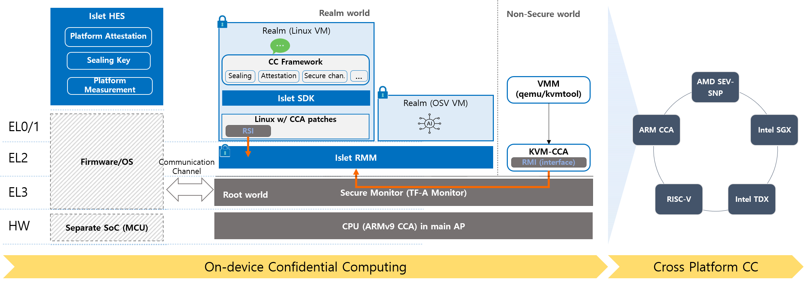

Islet is an open-source software project written in Rust that enables confidential computing
on ARM architecture devices using the ARMv9 CCA.
The primary objective of Islet is to enable on-device confidential computing
and protect user privacy on end user devices.

While current confidential computing solutions mainly focus on server-side
protection,  it is equally important to safeguard user information at the user
device level  since that is where private data collection initially occurs.
Furthermore, as more and more users rely on privacy apps such as private
messengers,  secure emails, password managers, and web browsers with privacy
settings,  there is a growing need to ensure privacy on user devices.
Islet, an open-source project, addresses this need by providing a platform
 for ARM-based confidential computing.

Enabling CC on user devices will not only establish end-to-end CC throughout
the entire data processing path,
but it will also help create a secure computation model
that enables processing of user private data on the user device
using the same components that previously were employed at the server side
without disclosing business logic.
Furthermore, on-device confidential computing will be a key enabler for
machine-to-machine computing without the need for server intervention

## Feature Overview
- Realm Management Monitor
- Hardware Enforced Security
- Confidential Computing API Standardization
- Automated Verification
- Use case : Confidential Machine Learning

## Overall Architecture

Islet provides a platform for running virtual machines (VMs)
confidentially, with standard SDKs for easy integration with other confidential
computing frameworks at upper layers.
The platform consists of two key components:
the Islet Realm Management Monitor (Islet-RMM) and Islet Hardware Enforced Security (Islet-HES).

- `Islet RMM` operates at EL2 in the Realm world on the application processor cores
and manages the confidential VMs, known as realms.
- On the other hand, `Islet HES` performs device boot measurement, generates
platform attestation reports, and manages sealing key functionality within a secure
hardware IP apart from the main application processor.

In designing Islet, we aim to to address the current security challenges in confidential
computing technologies right from the very beginning.
To ensure that our software is built with safety in mind, we have chosen to use the
Rust programming language, known for its unique security model that ensures memory
safety and concurrency safety.
Moving forward, we also plan to incorporate formal
verification techniques to further enhance the security of our design and implementation.

For more information, please visit our [developer site](https://islet-project.github.io/islet/).

## A demo video (Confidential ML)

- This video shows how Islet achieves an end-to-end confidential machine learning with a chat-bot scenario.
- This video flows as follows.
  1. It starts with a slide that describes all components involved in this demo. All components will run on confidential computing platforms.
  2. (*feed an ML model*) The model provider feeds the ML model into the ML server. This is done through a secure channel established with the aid of the certifier framework.
  3. (*run a coding assistant*) A mobile device user asks a chat-bot application that runs on Islet for generating a function. And then, that request is passed on to the ML server through a secure channel. Finally, the user can see the result (i.e., function).
  4. (*launch a malicious server*) This time, we launch a malicious server to show a failure case. When it attempts to join the certifier service (on the right side of the screen), it will not pass authentication as it results in a different measurement. Therefore, the malicious server cannot interact with the mobile device user in the first place.
- To download this video, click [here](https://github.com/islet-project/islet/raw/main/examples/confidential-ml/video/confidential_ml.mp4).
