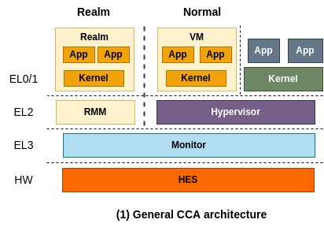
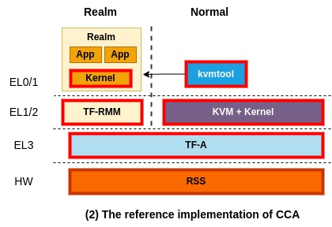
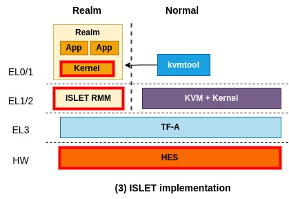

# Platform architectures

This page aims to describe an overall CCA platform architecture and what components ISLET is going to make a valuable addition to as a manufacturer.

## The general CCA architecture

The general CCA architecture is depicted above. From the high level perspective, you think of this architecture as the one similar to a conventional TrustZone application programming model where one application breaks down into two pieces, one for normal world and the other one for secure world. More precisely, a virtual machine that runs on the normal world can securely delegate confidential operations to a corresponding realm.

You might not want to split up an application into two pieces. Instead, you may want to put a whole application in Realm and run it without code changes as confidential container does.
That scenario can also be realized and is specified in the next section.

In this architecture, RMM (Realm Management Monitor) and Monitor (also known as EL3 Monitor, shortly EL3M) are called trusted firmware components that CCA relies on for security, therefore they must be securely implemented and verified. Monitor manages GPT (Granule Protection Table) which tracks which world each physical page belongs to and is responsible for context switching between different worlds (i.e., between Realm world and Normal world).

More specifically, a physical page assigned to a realm is marked as a realm page in GPT and it is used in memory translation. So, when a VM that runs on Normal world attempts to access that page, it will result in a translation fault. This is how CCA offers isolation between different worlds and enables dynamic secure memory allocation.

On top of it, RMM takes the responsibility of isolating a realm from the other realms, by making use of existing virtualization-based isolation technologies such as NPT (Nested Page Table). Also, it controls the execution of Realm as typical hypervisors do and is responsible for interacting with Normal world to provide some services, for example sending a network packet through VirtIO to Normal world.

Lastly, HES (Hardware Enforced Security) represents a dedicated hardware component that is separated from CPUs and behaves as RoT (Root of Trust). Detaching the ability of RoT from Monitor (i.e., firmware that runs on CPU) helps to minimize the responsibility of RMM. 

## The reference implementation of CCA

ARM has been working hard to bring and merge the reference implementation of CCA into a open-source ecosystem. The above picture depicts the current reference implementation of CCA at the time of this writing. Red boxes represent components that are making up of the reference implementation.
They implement and manage [TF-RMM](https://www.trustedfirmware.org/projects/tf-rmm/) and [TF-A](https://www.trustedfirmware.org/projects/tf-a/) for RMM and Monitor, respectively, and use them for the reference implementation of CCA.
Also, for HES, they implement [RSS](https://tf-m-user-guide.trustedfirmware.org/platform/arm/rss/readme.html) that runs on a dedicated MCU (Micro Controller Unit) isolated from CPUs.

For a software stack of virtualization, ARM currently uses a combination of KVM and kvmtool which is a light-weight VMM (virtual machine monitor). kvmtool is a tiny VMM written in C and offers basic functionalities to launch and manage a KVM VM, including virtio. To launch a realm, kvmtool takes as input a kernel binary and a root file system and asks TF-A (Monitor) for creating and executing the realm. That request passes through a linux kernel that supports interaction with Monitor. 

Lastly, an OS kernel that runs on Realm has to be updated to interact with TF-RMM. For example, a realm can ask TF-RMM for generating an attestation report.

## ISLET implementation

This picture shows what ISLET is working on to augment CCA in the direction we want. The most important part would be ISLET RMM which adheres to the specification of RMM but is written in Rust. We choose Rust to benefit from its strong type system and compile-time security, making things easier to reason about the security of complicated software.

In addition to rewriting RMM in Rust, we're planning to put in some new features that are needed to accomplish our goals and could differentiate ISLET RMM from TF RMM.
Note that what features to add in are still in internal discussion.
Also, we're working on designing and developing our own HES tailored for real hardware platforms.

Other than the above components, ISLET currently relies on the reference implementation of CCA.
