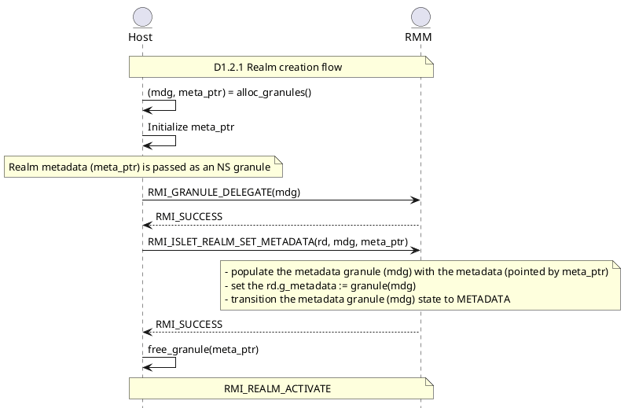
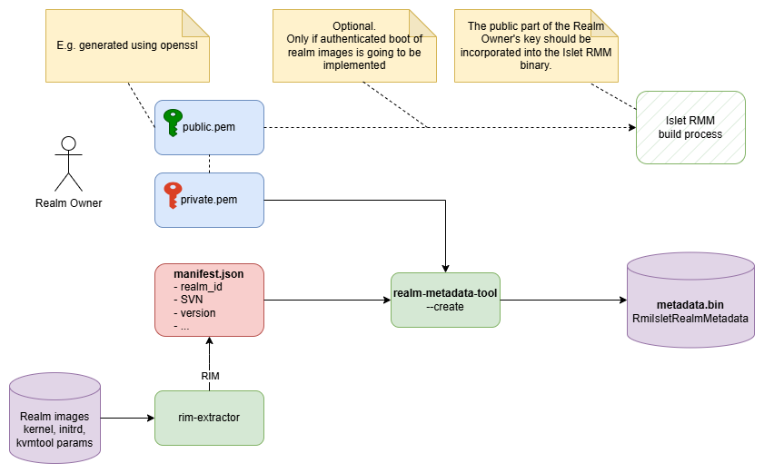

# Realm metadata

## Introduction

Currently, neither the [Arm CCA Security Model 1.0](https://developer.arm.com/documentation/DEN0096/latest/) nor the [Realm Management Monitor specification](https://developer.arm.com/documentation/den0137/1-0rel0/?lang=en) describes any mechanism that provides a metadata block with identity information about a launched Realm (similar to "ID block" in [AMD SEV-SNP](https://www.amd.com/en/developer/sev.html), or SIGSTRUCT in [Intel SGX](https://www.intel.com/content/www/us/en/products/docs/accelerator-engines/software-guard-extensions.html)). Such metadata can be used in **sealing key derivation** or **authenticated boot** of realm images.

The current Arm CCA Security Model is aligned with the general concepts of [Confidential Computing](https://confidentialcomputing.io/wp-content/uploads/sites/10/2023/03/CCC-A-Technical-Analysis-of-Confidential-Computing-v1.3_unlocked.pdf) (CC). CC targets mainly **Cloud Computing** environments, where there is freedom of choice on what can be launched in realms. It is up to external entities to determine whether a particular VM and a platform are trustworthy. This trust decision is achieved by the **remote attestation** process. In this process, the verification of the Realm (and platform) is delayed and delegated to an external Verifier and a Reliant Party that wants to establish trust in the Realm.

This is opposite to the security model used in mobile environments. For example, in the case of **Android Virtualization Framework** (AVF), all critical software components are authenticated before launching (via Android Verified Boot). This means that not only the firmware but also the virtual machine images (like Microdroid) are authenticated right before launching.

In the Islet project, we have designed and implemented the **realm metadata** mechanism for the following reasons:

1. We need to have sealing keys immune to software and firmware updates. This can be solved by using a similar approach as described in the [Open Profile for DICE](https://pigweed.googlesource.com/open-dice/+/refs/heads/main/docs/specification.md) specification. Instead of using Realm Initial Measurements (RIMs) as a key material, we can use so-called "Authority Data". The authority data allows us to identify the developer of a particular realm image. We can combine authority data with the realm identifier to reliably identify a particular realm. This can be done by providing RMM with an additional signed metadata structure that contains supplementary information about a launched Realm image.
2. The authenticated metadata block provides information (e.g., realm ID, security version number) that could be used to implement a **rollback protection** mechanism (Note that this case is not in the scope of the current design and implementation).
3. We can use the realm metadata block to implement **authenticated boot** of realms (similar to Arm's "secure boot"). The reason why such an authenticated boot could be useful is that the On-device Confidential Computing solution targets mobile phones, TV sets, and other devices with limited resources. Thus, contrary to classical Confidential Computing, the platform should be able to protect itself from running unauthorized code that may exhaust resources (e.g., DDoS attacks mentioned in section 5.2.2 of [A Technical Analysis of Confidential Computing](https://confidentialcomputing.io/wp-content/uploads/sites/10/2023/03/CCC-A-Technical-Analysis-of-Confidential-Computing-v1.3_unlocked.pdf)). Additional authentication of launched realms gives greater control over the software running in a realm (Note that this case is not in the scope of the current design and implementation).

## General description

Our design is based on the following assumptions:

- The realm metadata structure populated during the Realm creation process should not be measured (it should not affect the RIM).
- An additional RMI should be used to pass the Realm metadata
- The metadata should contain the following information
    - `Format Version` - a version of the manifest's format
    - `Realm ID` - a unique identifier of the Realm Image
    - `RIM` - Realm Initial Measurement - it binds the Realm image to the metadata structure
    - `SVN` - Security Version Number - it should be increased only when there is a new release of a Realm image that fixes security issues. SVN can be used by a rollback protection mechanism
    - `Version` - a version of the Realm Image. A scheme similar to semantic versioning could be used here (simplified [https://semver.org/](https://semver.org/) that uses only the "version core" expression)
    - `Public Key` - used for verification of the metadata block - it also uniquely identifies the owner of the realm
    - `Signature`
- The metadata should be cryptographically signed using a realm owner's private key associated with the `Public Key`. This allows checking the integrity and authenticity of the metadata block.

The other assumption is that the realm metadata mechanism should fit into the existing RMM implementation in the least invasive way possible. First and foremost, the existing APIs described in the RMM specification should not change, and the additional interface should be provided using vendor-specific SMCs.

The provisioning of a realm metadata structure should be performed using the following steps:

1. The realm is created using the standard **RMI_REALM_CREATE** call
2. A realm metadata structure is populated using the **RMI_ISLET_REALM_SET_METADATA** call. This is an optional step. During provisioning, the RMM performs an additional verification (signature, validity) step of the provided structure. After successful verification, the handle to the metadata block is saved in the Realm Descriptor.
3. The realm content is populated in a standard way (**RMI_DATA_CREATE**, etc.)
4. During **RMI_REALM_ACTIVATE** handling, when the RIM calculated in runtime is ready and stable, the computed RIM is compared against the RIM taken from the populated realm metadata structure. Of course, this check occurs only if the realm metadata block was previously provisioned using **RMI_ISLET_REALM_SET_METADATA**. As mentioned earlier, provisioning of the realm metadata block is currently optional, and we also allow populating and launching realms in a standard way.

Note that the **RMI_ISLET_REALM_SET_METADATA** command can be called anytime between the **RMI_REALM_CREATE** and **RMI_REALM_ACTIVATE** calls.

## RMM interface specification

This section describes the changes in the RMM interfaces to provide additional realm metadata functionality.

### Changes in the Realm Management Interface (RMI)

#### RMI_ISLET_REALM_SET_METADATA command

To pass the additional Realm metadata (represented as the **RmiIsletRealmMetadata** structure), we introduce an additional vendor-specific command **RMI_ISLET_REALM_SET_METADATA** (see [Vendor specific SMC Allocation for Realm Metadata mechanism and Sealing Keys Derivation](./vendor_specific_smcs.md)).

Currently **RMI_ISLET_REALM_SET_METADATA** takes the following input values:

| Name | Register | Bits | Type | Description |
| --- | --- | --- | --- | --- |
| fid | X0 | 63:0 | UInt64 | FID, value 0xC7000150 |
| rd | X1 | 63:0 | Address | PA of the RD for the target Realm |
| mdg | X2 | 63:0 | Address | PA of the delegated granule for storing the RmiIsletRealmMetadata (metadata granule) |
| meta_ptr | X3 | 63:0 | Address | PA of the host provided RmiIsletRealmMetadata structure |

In the current design we try to keep the size of the Realm metadata structure as small as possible. Currently, the size of **RmiIsletRealmMetadata** is 432 bytes, and it easily fits within only one extra granule (4096 bytes) that has to be delegated to the Realm World and assigned to the realm descriptor (note that the abstract **RmmRealm** type should also be adjusted to keep the pointer to the delegated metadata granule - this and other changes are described in the [Changes in the RMM specification](#changes-in-the-rmm-specification) section).

Here is a detailed description of the **RmiIsletRealmMetadata** structure.

| Name | Byte offset | Type | Description |
| --- | --- | --- | --- |
| `fmt_version` | 0x0 | UInt64 | The version of the manifest format (0x1 for this very format) |
| `realm_id` | 0x8 | UInt8[128] | The identifier of the realm - a left-padded ASCII string containing printable characters, where the end of the string is marked as '\0' and unused remaining bytes should be filled with zeros. |
| `rim` | 0x88 | `RmmRealmMeasurement` (UInt8[64]) | The expected Realm Initial Measurement (RMM spec C1.17, 512 bits) |
| `hash_algo` | 0xc8 | UInt64 | A hash algorithm used to calculate RIM (0x1 - SHA-256, 0x2 - SHA-512) |
| `svn` | 0xd0 | UInt64 | Security Version Number (increased only if security issues are patched) |
| `version_major` | 0xd8 | UInt64 | Version Major number |
| `version_minor` | 0xe0 | UInt64 | Version Minor number |
| `version_patch` | 0xe8 | UInt64 | Version Patch number |
| `public_key` | 0xf0 | UInt8[96] | The public key encoded as two 384-bit Big Integers (x and y) |
| `signature` | 0x150 | UInt8[96] | The signature is encoded as two 384-bit Big Integers (r and s according to "4.1.3, Signing Operation" of [SEC 1: Elliptic Curve Cryptography](https://www.secg.org/sec1-v2.pdf)) |

> [!NOTE]
> The little-endian byte order is used for encoding numbers. The signature should be calculated from the first 0x150 bytes of the **RmiIsletRealmMetadata** structure. The proposed signature algorithm is **ECDSA P-384** with **SHA-384** (hash-then-sign, [secp384r1](https://std.neuromancer.sk/secg/secp384r1)).

> [!NOTE]
> It is recommended to use a reverse domain name ([https://en.wikipedia.org/wiki/Reverse_domain_name_notation](https://en.wikipedia.org/wiki/Reverse_domain_name_notation)) or similar notation to encode the `realm_id` field, because this format includes a globally unique domain name of a realm owner and also a particular realm name, which significantly reduces naming collisions.

Here are the details of how the **RMI_ISLET_REALM_SET_METADATA** command is handled:

- Firstly, the host performs a standard procedure of realm creation using the **RMI_REALM_CREATE** command as described in the "D1.2.1 Realm creation flow" section of [RMM spec 1.0-REL0](https://developer.arm.com/documentation/den0137/1-0rel0/?lang=en).
- Once the realm is created, the host allocates two granules: one granule pointed to by `meta_ptr` that is used to pass the `RmiIsletRealmMetadata` content, and one granule (`mdg`) that is used to keep the metadata on the Realm World side.
- The metadata structure pointed to by `meta_ptr` is initialized.
- The host calls RMI_GRANULE_DELEGATE(mdg) to delegate a dedicated metadata granule to the Realm World
- The host calls RMI_ISLET_REALM_SET_METADATA(rd, mdg, meta_ptr)
    - The metadata structure passed via `meta_ptr` is copied into the RMM
    - The copy of the metadata structure is validated and its authenticity and integrity are checked
    - The Realm Descriptor is checked: its state should be NEW and its metadata field should be empty
    - The metadata granule (`mdg`) content is populated using the previously verified metadata structure copy
    - In the last step, the state of the metadata granule (mdg) is changed to METADATA and assigned to the Realm Descriptor
- The host frees the memory pointed to by `meta_ptr`

This procedure is depicted in the sequence diagram below.

*Figure 1: Handling of realm metadata - sequence diagram*

> [!NOTE]
> The **RMI_ISLET_REALM_SET_METADATA** can be called only once on a valid Realm Descriptor (rd) initialized using **RMI_REALM_CREATE**, and before **RMI_REALM_ACTIVATE** call (i.e. it can be performed when the realm state is RmmRealmState::REALM_NEW).

Here are more details about **RMI_ISLET_REALM_SET_METADATA** command.

**Output values**

| Name | Register | Bits | Type | Description |
| --- | --- | --- | --- | --- |
| result | X0 | 63:0 | RmiCommandReturnCode | Command return status |

**Failure conditions**

| ID | Condition |
| --- | --- |
| rd_align | pre: !AddrIsGranuleAligned(rd) post: ResultEqual(result, RMI_ERROR_INPUT) |
| rd_bound | pre:    !PaIsDelegable(rd) post:    ResultEqual(result, RMI_ERROR_INPUT) |
| rd_state | pre:    Granule(rd).state != RD post:    ResultEqual(result, RMI_ERROR_INPUT) |
| realm_state | pre:    Realm(rd).state != REALM_NEW post:    ResultEqual(result, RMI_ERROR_REALM) |
| mdg_align | pre:    !AddrIsGranuleAligned(mdg) post:    ResultEqual(result, RMI_ERROR_INPUT) |
| mdg_bound | pre:    !PaIsDelegable(mdg) post:    ResultEqual(result, RMI_ERROR_INPUT) |
| mdg_state | pre:    Granule(mdg) != DELEGATED post:    ResultEqual(result, RMI_ERROR_INPUT) |
| meta_ptr_align | pre:    !AddrIsGranuleAligned(meta_ptr) post:    ResultEqual(result, RMI_ERROR_INPUT) |
| meta_ptr_bound | pre:    !PaIsDelegable(meta_ptr) post:    ResultEqual(result, RMI_ERROR_INPUT) |
| meta_ptr_pas | pre:    !GranuleAccessPermitted(meta_ptr, PAS_NS) post:    ResultEqual(result, RMI_ERROR_INPUT) |
| meta_ptr_format | pre:  meta_ptr.fmt_version != 0x1 post: ResultEqual(result, RMI_ERROR_INPUT) |
| meta_ptr_hash | pre: meta_ptr.hash_algo != 0x1 && meta_ptr.hash_algo != 0x2 post: ResultEqual(result, RMI_ERROR_INPUT) |
| meta_ptr_realm_id | pre: !IsRealmIdFormatValid(meta_ptr.realm_id) post: ResultEqual(result, RMI_ERROR_INPUT) |
| metadata_valid | pre: !RmiIsletRealmMetadataIsValid(meta_ptr) post: ResultEqual(result, RMI_ERROR_INPUT) |

Where `IsRealmIdFormatValid(addr)` is a function that returns a boolean value of TRUE, only when the address points to a string:

- terminated with '\0'
- is of length greater than zero
- contains only printable ASCII characters

The `RmiIsletRealmMetadataIsValid` function performs following steps:
- it check whether is `fmt_version` is valid (it should be 0x1)
- it verifies the `signature` using the embedded `public_key` over the metadata using a digital signature algorithm (**ECDSA P-384** with **SHA-384** (hash-then-sign)) as described earlier in this section. The `RmiIsletRealmMetadataIsValid` function is used during the handling of **RMI_ISLET_REALM_SET_METADATA** and is described in the [Realm authentication process](#realm-authentication-process) section.

**Success conditions**

| ID | Condition |
| --- | --- |
| mdg_state | Granule(mdg).state == METADATA |

#### RMI_REALM_ACTIVATE command

This section describes the changes to **RMI_REALM_ACTIVATE** handling.

**Failure conditions (B4.3.8.2)**

| ID | Condition |
| --- | --- |
| rim_is_valid | pre: Realm(rd).g_metadata != Zeros() && !RmiIsletRIMIsValid(Realm(rd), Realm(rd).g_metadata) post: ResultEqual(result, RMI_ERROR_REALM) |

The function `RmiIsletRIMIsValid()` checks if:

- the RIM read from the RD is the same as that provided in the realm metadata structure
- the hash algorithm used to calculate the RIM read from the RD is the same as that provided in the realm metadata structure

If both conditions are successful, the function returns true.

#### Changes in the RMM specification

Here are the related changes in the RMM specification (RMM specification, 1.0-rel0).

**A2.2.3 Granule lifecycle**
**A.2.2.3.1 States**

Additional granule state.

| Granule state | Description | GPT entry |
| --- | --- | --- |
| METADATA | Realm Metadata | GPT_REALM |

**A2.2.3.2 State transitions**

Additional state transitions.

| From state | To state | Events |
| --- | --- | --- |
| METADATA | DELEGATED | RMI_REALM_DESTROY |
| DELEGATED | METADATA | RMI_ISLET_REALM_SET_METADATA |

**C1.16 RmmRealm type**

Additional field in RmmRealm type pointing to the physical address of realm metadata granule.

| Name | Type | Description |
| --- | --- | --- |
| metadata | Address | The physical address of a granule containing the Realm metadata (RmiIsletRealmMetadata) |

**B4.3.10.3 Success conditions (RMI_REALM_DESTROY)**

| ID | Condition |
| --- | --- |
| metadata_state | Granule(Realm(rd).metadata).state == DELEGATED |

Note that the metadata granule should be zeroed and transitioned to the **DELEGATED** state.

## Realm authentication process

> [!IMPORTANT]
> Current implementation **does not** provide **authenticated boot** and **rollback protection** functionalities for Realms. If in the future such a need arises, this section provides implementation guidance on how such functionality could be implemented.

> [!NOTE]
> If **rollback protection** has to be enabled, a **Secure Version Storage** has to be available to the RMM. Usually it can be provided as a **Trusted Application** (TA) running in a secure world (TrustZone); this application can have exclusive access to a hardware **Replay Protected Memory Block** (RPMB) eMMC device used as secure storage resistant to rollback attacks.

> [!NOTE]
> If the realm **authenticated boot** is going to be used, the [Trust Anchor](https://csrc.nist.gov/glossary/term/trust_anchor) in the form of a public key for verification of the authenticity of the Realm image should be embedded within the Islet RMM binary. Note that this is the simplest way of providing the Trust Anchor for authenticated boot. In future versions of the realm metadata mechanism, the embedded public key can be encoded as an X.509 leaf certificate (or CBOR Encoded X.509 Certificates) together with an intermediate certificate chain, and the Islet RMM can have access to a root CA certificate. In this case, the whole certificate chain up to the root CA certificate will be verified. This scheme will allow splitting the roles of a realm owner and the CCA supply chain (an entity that is responsible for preparation of the CCA platform (HW, firmware including Islet RMM)). At the same time, it will require additional PKI infrastructure on the CCA supply chain side for verifying and signing CSRs sent by Realm owners.

The Realm metadata verification procedure (within the scope of the `RmiIsletRealmMetadataIsValid` procedure) should be performed while handling **RMI_ISLET_REALM_SET_METADATA**, and it should include the following steps:

1. If the `RmiIsletRealmMetadata` block **has not been** provided by **RMI_ISLET_REALM_SET_METADATA** command, the handling of **RMI_REALM_ACTIVATE** should proceed in a standard way. Otherwise during the handling of **RMI_ISLET_REALM_SET_METADATA**, RMM needs to:
2. Check if the `RmiIsletRealmMetadata.fmt_version` is valid.
3. Check the integrity of the `RmiIsletRealmMetadata` by checking the signature using `ECDSA P-384` with SHA-384 algorithm and `RmiIsletRealmMetadata.public_key`.

Any failure of the above steps should result in a failure of the realm metadata setting process and thus the launching process of the realm.

If the `RmiIsletRealmMetadata` block **has been provided** by the **RMI_ISLET_REALM_SET_METADATA** call, the **RMI_REALM_ACTIVATE** should perform the following steps:

1. (**Optional** step - only if **authenticated boot** is going to be implemented) RMM should check if the `public_key` read from the `RmiIsletRealmMetadata` is the same as the key **embedded** in the RMM binary.
2. Check whether the RIM calculated during the loading process of the realm and the RIM read from the provided **RmiIsletRealmMetadata** are the same.
3. Check if the **hash algorithm** used to calculate RIM in runtime is the same as that provided in the `RmiIsletRealmMetadata` structure
4. (**Optional** step, when the **rollback protection** is going to be implemented) In case when the rollback protection is enabled, the RMM should compare the `RmiIsletRealmMetadata.svn` against the `svn` read from the `Version Storage` identified by the `public_key` and `realm_id` pair.
    - If the `RmiIsletRealmMetadata.svn` is less than that read from the `Version Storage`, the launching process should be interrupted.
    - If the values are the same, the launching process should continue.
    - If the `RmiIsletRealmMetadata.svn` is greater than that read from the `Version Storage`, the corresponding `svn` in the `Version Storage` should be updated (it should be set to `RmiIsletRealmMetadata.svn`), and the launching process should continue.

Any failure of the above steps should result in the **failure** of the realm activation process. Note that the steps should be performed in this very order.

> [!NOTE]
> Note, if the **RmiIsletRealmMetadata** was not populated, the **RMI_REALM_ACTIVATE** call should be handled in a standard way.

## Required changes in firmware and software components

*Figure 2: The workflow of generating a binary file containing a realm metadata structure*

### realm-metadata-tool

To generate a binary version of the `RmiIsletRealmMetadata` structure, a dedicated command-line tool called [realm-metadata-tool](https://github.com/islet-project/realm-metadata-tool) has been implemented. The tool takes a manifest file in YAML format and the private key (in PEM format) and produces a binary file containing the `RmiIsletRealmMetadata` structure. For more information, please refer to the realm-metadata-tool [README](https://github.com/islet-project/realm-metadata-tool/blob/main/README.md) document. Note that to obtain the RIM needed by the manifest file, one can use a kvmtool-based RIM measurer, which can be found [here](https://github.com/islet-project/3rd-kvmtool/tree/kvmtool-rim-measurer/aosp/cca/v4).

> [!NOTE]
> Note that the management of the keys used to sign the realm metadata structure is the responsibility of the Realm owner. The same applies to the storage, management, and distribution of realm images and their associated metadata.

### kvmtool

The path to the generated metadata binary file from **realm-metadata-tool** can be passed to the [kvmtool](https://github.com/islet-project/3rd-kvmtool/tree/aosp/cca/v4) via the `--metadata` option. During the Realm setup, kvmtool transfers that metadata blob using dedicated ioctls to the host Linux kernel KVM layer, which then transfers it to the Islet RMM using the **RMI_ISLET_REALM_SET_METADATA** command.

The source code of the kvmtool capable of handling **realm metadata** can be found [here](https://github.com/islet-project/3rd-kvmtool/tree/aosp/cca/v4).

### Linux kernel (host)

The [KVM/RME](https://github.com/islet-project/3rd-android-kernel/blob/android16-6.12/cca-host/v5/arch/arm64/kvm/rme.c) layer of the host Linux kernel has been extended to handle an additional `KVM_CAP_ARM_RME_POPULATE_METADATA` command used by kvmtool to pass the realm metadata.
The source code of the host Linux kernel that can handle **realm metadata** can be found [here](https://github.com/islet-project/3rd-android-kernel).

### Islet RMM

**Islet RMM** provides implementation of **realm metadata** handling in the following files:

- [rmm/src/rmi/realm/mod.rs](https://github.com/islet-project/islet/blob/main/rmm/src/rmi/realm/mod.rs) implements a handler for the **RMI_ISLET_REALM_SET_METADATA** RMI, metadata handling during realm activation and destruction
- [rmm/src/rmi/metadata.rs](https://github.com/islet-project/islet/blob/main/rmm/src/rmi/metadata.rs) implements `RmiIsletRealmMetadata` structure and the main **realm metadata** functionality.

### TF-A

The **TF-A** source code has been modified to route additional RMI for handling realm metadata ([services/islet_svc/islet_svc_setup.c](https://github.com/islet-project/3rd-tf-a/blob/hes/services/islet_svc/islet_svc_setup.c)).

## Security analysis and threat model

This section discusses the security properties of the realm metadata mechanism, potential attack vectors, and how the design mitigates them.

### Trust assumptions

- The **RMM** is trusted to correctly enforce the realm metadata verification and RIM comparison logic.
- The **host** (including the hypervisor, kvmtool, and the Linux kernel KVM layer) is **not trusted** — it may be compromised or malicious.
- The **realm owner's private key** is trusted to be kept secret and properly protected by the realm owner.
- The **TF-A** (EL3 firmware) is trusted to correctly route SMCs to the RMM.

### Threat model

#### T1: Metadata tampering

**Threat**: A compromised host modifies one or more fields of the `RmiIsletRealmMetadata` structure (e.g., changes the `realm_id`, `svn`, or `rim`) before or during the `RMI_ISLET_REALM_SET_METADATA` call.

**Mitigation**: The metadata structure is cryptographically signed using ECDSA P-384 with SHA-384. The signature covers the first 0x150 bytes of the structure, which includes all mutable fields except `signature`. Any modification to the signed portion invalidates the signature, and the `RmiIsletRealmMetadataIsValid` check will fail, causing the `RMI_ISLET_REALM_SET_METADATA` command to return an error. The RMM copies the metadata from the host-provided NS granule into its own memory before performing verification, ensuring that the host cannot modify the data after verification.

#### T2: Signature forgery

**Threat**: An attacker attempts to forge a valid signature on a crafted or modified metadata block without possessing the realm owner's private key.

**Mitigation**: The use of ECDSA P-384 with SHA-384 provides a 192-bit security level against signature forgery, which is considered well beyond the reach of computational attacks. The RMM verifies the signature using the `public_key` embedded in the metadata structure itself. Note that in the current design (without authenticated boot), the RMM does not verify that the `public_key` belongs to a trusted authority — it only verifies that the signature is valid for the given public key. This means any entity can create a validly signed metadata block. The security guarantee in the current design is **integrity and self-consistency**, not **authorization**. Authorization requires the authenticated boot extension (see [Realm authentication process](#realm-authentication-process)).

#### T3: Metadata replay (rollback attack)

**Threat**: A compromised host replays a previously valid metadata block corresponding to an older version of the realm image (with known vulnerabilities) to launch a realm with downgraded security.

**Mitigation**: The current implementation **does not** provide rollback protection. The `svn` field is included in the metadata structure to support future rollback protection, but without a Secure Version Storage (e.g., RPMB-backed storage accessible via a TrustZone TA), the RMM cannot detect replay of older metadata blocks. If rollback protection is implemented in the future, the RMM would compare the `svn` in the metadata against the stored SVN value, rejecting downgrades as described in the [Realm authentication process](#realm-authentication-process) section.

#### T4: RIM mismatch / realm image substitution

**Threat**: A compromised host provides a validly signed metadata block but attempts to load a different realm image whose computed RIM does not match the `rim` field in the metadata.

**Mitigation**: During `RMI_REALM_ACTIVATE`, the RMM compares the RIM computed during the realm loading process against the `rim` field stored in the metadata structure. If they do not match, the activation is rejected (`RMI_ERROR_REALM`). This ensures that the metadata is bound to the specific realm image being launched. Additionally, the `hash_algo` field is verified to match the algorithm used for RIM computation, preventing algorithm substitution attacks.

#### T5: Metadata removal / bypass attack

**Threat**: A compromised host simply does not provide metadata via `RMI_ISLET_REALM_SET_METADATA`, thereby bypassing all metadata-based checks and launching a realm without authentication.

**Mitigation**: In the current design, providing metadata is **optional**. A realm can be launched without metadata, and in that case, `RMI_REALM_ACTIVATE` proceeds in the standard way without RIM comparison against a metadata-provided value. This is by design — the current mechanism provides **opt-in** authentication. If **authenticated boot** is implemented in the future, the RMM would require metadata for all realms (or for a specific class of realms) and reject activation attempts without valid metadata. This would require embedding a trust anchor (public key) in the RMM binary.

#### T6: Denial of service via invalid metadata

**Threat**: A compromised host provides invalid metadata (e.g., with an invalid signature or mismatched RIM) to prevent a legitimate realm from launching.

**Mitigation**: The host is already in full control of the realm lifecycle and can deny service by simply not creating the realm. This is an inherent property of the CCA security model where the host manages the realm lifecycle. The metadata mechanism does not introduce a new DoS vector beyond what already exists. If the host provides invalid metadata, the realm creation fails, but the host can retry without metadata.

#### T7: Key compromise

**Threat**: The realm owner's private key used to sign the metadata is compromised, allowing an attacker to create validly signed metadata for arbitrary realm images.

**Mitigation**: The current design does not include a key revocation mechanism. If the private key is compromised, the attacker can forge metadata for any realm signed with that key. Potential mitigations include:

- Embedding a list of revoked public keys in the RMM binary (requires RMM updates).
- Including a key identifier and revocation list in a future `fmt_version` of the metadata structure.
- Using short-lived certificates with expiration times (would require additional fields in the metadata structure).

Key compromise handling is deferred to a future design iteration.

#### T8: Metadata structure replacement after initial setting

**Threat**: A compromised host attempts to call `RMI_ISLET_REALM_SET_METADATA` multiple times to replace the metadata with a different block.

**Mitigation**: The `RMI_ISLET_REALM_SET_METADATA` command can only be called **once** per realm. The RMM checks that the Realm Descriptor's metadata field is empty before accepting a new metadata block. If metadata has already been set, the command returns an error. This prevents the host from replacing metadata after initial provisioning.

#### T9: Side-channel attacks on signature verification

**Threat**: An attacker uses side-channel analysis (timing, power, etc.) to extract information about the private key during signature verification in the RMM.

**Mitigation**: The RMM performs signature **verification** (not signing), so the private key is never present in the RMM's memory. Side-channel attacks on ECDSA verification do not leak the private key. However, implementers should ensure that the verification implementation is constant-time to prevent timing side-channels that could potentially leak information about the public key or the message being verified.

