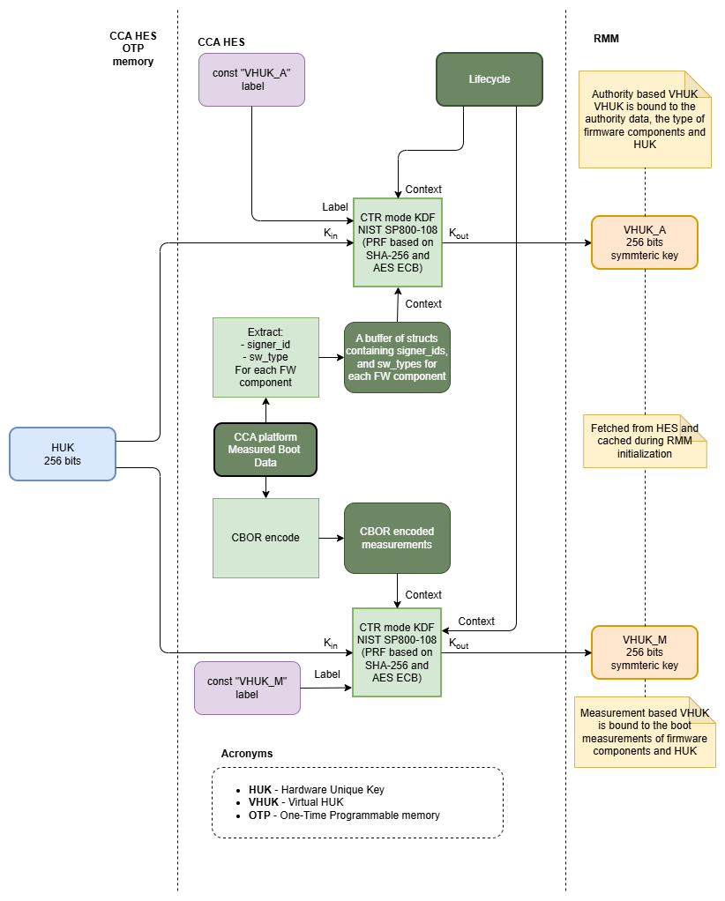
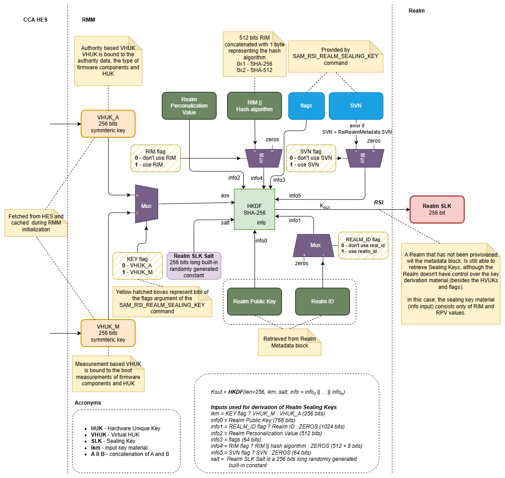
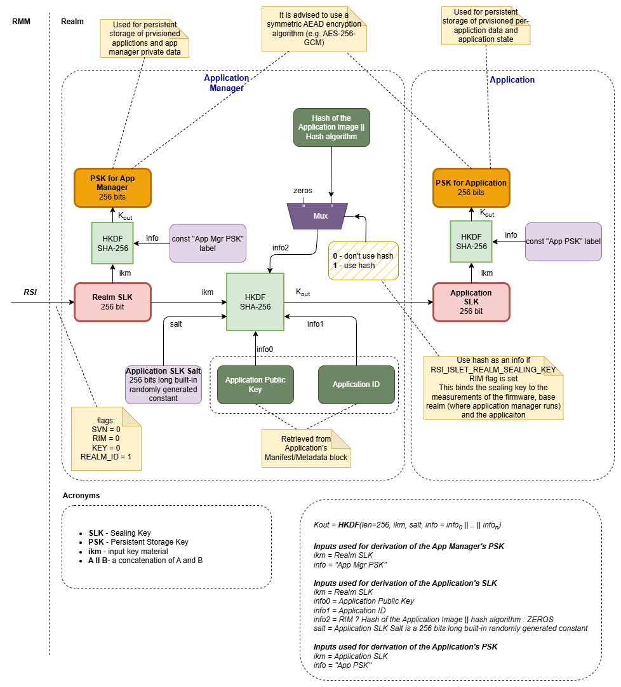
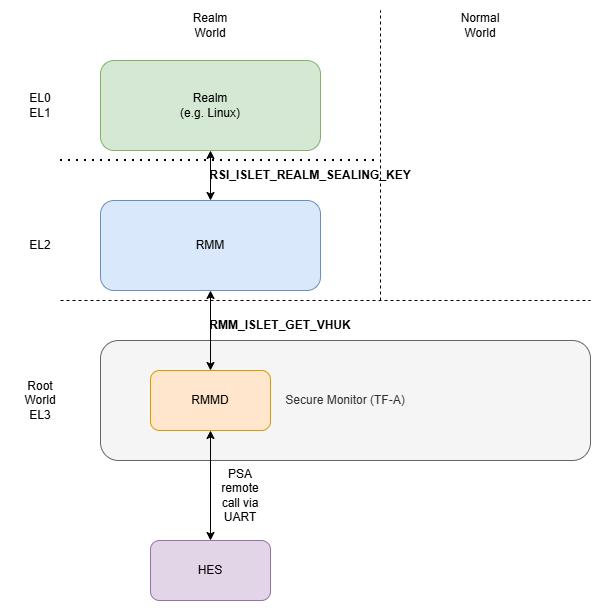

# Sealing Key Derivation

## Introduction

Sealing is a concept that is commonly used in many [Confidential Computing](https://en.wikipedia.org/wiki/Confidential_computing) technologies, like AMD SNP-SEV or Intel SGX. Sealing refers to a process of encrypting the data within a trusted execution environment (TEE), where an encryption key is bound to an enclave's identity, its state and a platform. This way, only the same enclave that encrypted the data is able to decrypt it (unsealing). Sealing requires a key derivation mechanism that is secure and allows binding the key to the enclave's identity, its state and a particular hardware platform.

This document describes the design and implementation of the Sealing Key Derivation mechanism for the Islet project.

## General description

The diagrams below show the sealing key derivation scheme for **Arm CCA** capable platforms. Here are the main ideas behind this design:

1. The sealing key should be bound to a particular hardware platform, thus the key derivation scheme takes as an input HUK (Hardware Unique Key, described in section "5.1 Hardware provisioned parameters" of [Arm CCA Security Model 1.0](https://developer.arm.com/documentation/DEN0096/latest/)). Binding the sealing key to HUK prevents unauthorized transfer of sealed data to another hardware platform.

2. The sealing key should be bound to the security lifecycle state of CCA Platform. This makes the sealed data inaccessible when someone tries to switch the platform into any other mode than Secured ([Arm CCA Security Model 1.0](https://developer.arm.com/documentation/DEN0096/latest/)). In particular, it prevents accessing the sealed data when the device is switched into non-secure debug modes.

3. The key derivation process by default takes an authority-based Virtual Hardware Unique Key (****VHUK_A****), a Realm Personalization Value, flags provided in the RSI command, and so-called Authority Data (please refer to the [Open Profile for DICE specification](https://pigweed.googlesource.com/open-dice/+/refs/heads/main/docs/specification.md)), which is identity information about the developer who created a particular firmware or software component. Relying on the Authority Data makes the derived keys immune to software and firmware updates as long as the realm and firmware come from the same developers.

4. The key derivation process is partially configurable. We can choose the input key material (authority-based or measurement-based **Virtual Hardware Unique Keys**). We can configure whether to include **RIM** (Realm Initial Measurement), **Realm ID** and **SVN** (Security Version Number) as key material during the key derivation process. This flexibility might be required when a Realm developer wants to seal the data to a particular Realm binary (setting the RIM flag), sacrificing the immutability of the sealing keys to SW/FW updates. This approach is similar to those implemented in [Intel SGX](https://eprint.iacr.org/2016/086.pdf) and AMD [SNP-SEV](https://www.amd.com/content/dam/amd/en/documents/epyc-technical-docs/specifications/56860.pdf).

5. We rely on the idea of a layered derivation process used by the "[Open Profile for DICE](https://pigweed.googlesource.com/open-dice/+/refs/heads/main/docs/specification.md)" specification. In our design, RMM produces the Realm sealing key for an operating system and indirectly to user space privileged services. For example, one of these services might be an application manager that is responsible for downloading, updating and launching applications. The application manager may use the Realm sealing key to derive secure persistent storage keys for its own purposes (e.g., persistent storage for downloaded applications) and a dedicated application sealing key (e.g., by using boot measurements of an application as info in the key derivation process). This layered approach ensures that any change of any of the firmware or software components placed below the application will result in a change of the application sealing key. As a result, the application is able to access its sealed data if and only if it is running on the same platform that uses the same firmware as at the moment when the data was sealed.

The key derivation methods to be secure should follow well-known standards and recommendations such as [RFC5869](https://datatracker.ietf.org/doc/html/rfc5869), [NIST SP 800-108r1](https://csrc.nist.gov/pubs/sp/800/108/r1/final), and [NIST SP 800-56cr2](https://csrc.nist.gov/pubs/sp/800/56/c/r2/final).

### Security considerations

Currently we're using an emulated environment and a stand-alone Islet HES application. In the future, Islet HES may be ported to real hardware platforms. Thus, it's worth mentioning what should be taken into account while porting HES to such platforms.

According to the [Arm CCA Security Model 1.0](https://developer.arm.com/documentation/DEN0096/latest/), **Hardware Unique Keys** once provisioned to the HES should not be collected at the platform manufacturer's premises, i.e., all copies should be destroyed once provisioned into CCA HES. The recommended solution is when HES generates the **HUK** itself internally during the first run and saves it within shielded locations (e.g., **One Time Programmable** memory). This approach effectively reduces the likelihood of the leakage of the key. Whether generated outside or inside the HES, the **HUK** should be generated using a high-quality RNG (Random Number Generator) that follows the recommendations of the [NIST SP 800-133r2](https://nvlpubs.nist.gov/nistpubs/SpecialPublications/NIST.SP.800-133r2.pdf) and [RFC4086](https://datatracker.ietf.org/doc/html/rfc4086) documents. This ensures the high entropy of the initial key material.

## Key derivation process

The process of sealing key derivation is split into three components: the CCA **HES** (Hardware Enforced Security), the Islet RMM and the Realm components.

### Derivation process of Virtual Hardware Unique Keys in HES

*Figure 1: Sealing key derivation process in HES*

The first step of the sealing key derivation process takes place in CCA HES, which produces **Virtual Hardware Unique Keys** (VHUKs) used as an **IKM** (**Input Key Material**) of the realm sealing key derivation process.

During the platform startup, HES gathers all firmware measurements from the AP (Application Processor) and other trusted subsystems. This information together with the **HUK** (**Hardware Unique Key**) and the security lifecycle state of CCA Platform is used to derive a 256-bit long ****VHUK_A**** (**Authority-based Virtual HUK**) and a 256-bit long ****VHUK_M**** (**Measurement-based Virtual HUK**).

The derivation process of **VHUK_A** and **VHUK_M** is performed on demand and is requested by RMM (Realm Management Monitor) during its initialization.

When deriving the **VHUK_A**, HES uses the collected signer_id and sw_type fields of the measurement_metadata_t structures of each firmware component. This makes the **VHUK_A** immune to firmware updates (including HES firmware and other trusted subsystems).

In the case of **VHUK_M**, the inputs include full boot measurements of all firmware components (struct measurement_t). **VHUK_M** is bound to particular versions of CCA Platform firmware.

Both Virtual Hardware Keys are bound to a particular instance of hardware (thanks to HUK). This prevents an attacker from unauthorized migration of the sealed data to another platform. Binding the keys to the lifecycle prevents accessing the sealed data when the platform runs in a debug mode.

The key derivation function used here is described in chapter 4.1 "KDF in Counter Mode" of [NIST SP800-108](https://csrc.nist.gov/pubs/sp/800/108/r1/final) where PRF (Pseudorandom Function) is based on SHA-256 and AES ECB. This is the same function that is already used for derivation of CPAK (CCA Platform Attestation Key) and DAK (Delegated Attestation Key that is also an alias of RAK - Realm Attestation Key).

### Derivation process of Realm Sealing Keys in RMM

During the RMM initialization, **VHUK_A** and **VHUK_M** are fetched from the HES via the TF-A's RMMD service. RMM caches both VHUKs for further derivations of Realm Sealing Keys (SLKs).

The diagram below depicts the details of the derivation process of realm sealing keys.

*Figure 2: Sealing key derivation process in Islet RMM*

After launching a Realm, the realm may request its own **Realm SLK** (Realm Sealing Key) by calling a dedicated **RSI** (**Realm Service Interface**) command **RSI_ISLET_REALM_SEALING_KEY** passing appropriate parameters.

The key derivation process is performed on demand, while handling the RSI command.

By default, the key derivation function takes as an input the **VHUK_A** (Authority-Based VHUK), the flags (passed as RSI input values), **Realm Public Key** and the **Realm Personalization Value**.

Optionally, **RIM** (**Realm Initial Measurement**), **Realm ID**, and user-provided **SVN** (**Security Version Number**) can be fed into the key derivation function.

Note that the **Realm Public Key** and the **Realm ID** are extracted from the **RmiIsletRealmMetadata** structure described in the [Realm metadata](./realm_metadata.md) document.

A caller may also choose the input key material, whether it is a **VHUK_M** (based on measurements) or **VHUK_A** (Authority-based VHUK). When the SVN flag is set, a caller must provide an SVN number (it can be previously retrieved by the realm software using the **RSI_ISLET_REALM_METADATA** command). The provided SVN number must be less than or equal to the SVN of the currently running realm (the SVN of the currently running realm is included in the RmiIsletRealmMetadata structure provided during the launch of the realm). This rule allows migrating sealed data from older realm versions to the newer ones while at the same time preventing older, possibly vulnerable, realms from accessing data created by the newer realm version. A similar mechanism is implemented in Intel SGX and AMD SEV-SNP. For more information please refer to section *5.7.2 Certificate-Based Enclave Identity* of [Intel SGX explained](https://eprint.iacr.org/2016/086.pdf) document and this article [https://www.intel.com/content/dam/develop/external/us/en/documents/hasp-2013-innovative-technology-for-attestation-and-sealing-413939.pdf](https://www.intel.com/content/dam/develop/external/us/en/documents/hasp-2013-innovative-technology-for-attestation-and-sealing-413939.pdf).

In the case when the realm has not been provisioned with the RmiIsletRealmMetadata block, the sealing key is to be derived from the fixed key material, i.e., RIM, hash algorithm, flags and the chosen VHUK. This allows realms that have not been provisioned with their metadata to still use the sealing mechanism. However, these derived keys are bound to the initial measurement of the realm, so in case of an update of such a realm, the sealing keys will change.

The key derivation function used in this derivation process is **HKDF** SHA-256 (**HMAC-based Key Derivation Function**) described in [RFC5869](https://datatracker.ietf.org/doc/html/rfc5869). The HKDF takes four parameters: the length of the output key, the initial key material (ikm), the constant salt parameter (generated using a high-entropy source) and the info parameter that allows binding the keys to different contexts. The info parameter is a fixed-length buffer that contains concatenated key material (inputs labeled as info0 to info5 in the diagram). Note that when a particular component of the info buffer is not used, it is substituted with the all-zeros buffer of the same length as the original component. The generated Realm Sealing Key is 256 bits long.

### Derivation process of Persistent Storage Keys in Realm

The diagram below depicts an **example** of how the Realm Sealing Keys can be utilized by software components running in a realm.

*Figure 3: Sealing key derivation process in a Realm*

The resulting "Realm SLK" (256 bits) can be used by Realm software components (e.g., Application Manager, applications) to perform further derivations of encryption keys for persistent storage.

In the example, the privileged Application Manager service derives two keys:

- PSK for App Manager - the Persistent Storage Key for encryption of the Application Manager's private data (e.g., provisioned applications, state, etc.). Note that the HKDF doesn't take salt here, which means that the salt is a zero-filled buffer.
- Application SLK - the Application Sealing Key derived from the "Realm SLK", Application Public Key and the Application ID (read from the application's manifest). If the persistent data has to be bound to a concrete binary version of the application, the Hash of the Application should be used as part of the info parameter.

The Application derives only one key:

- PSK for Application - it is a Persistent Storage Key derived from the "Application SLK" provided by the Application Manager Service.

> [!NOTE]
> The diagram is showing only an **example** how the "Realm SLK" could be used by the realm software for key derivations. The application provisioning mechanism and Arm CCA on Android subprojects use slightly different approach although conceptually they are similar to this example.

> [!CAUTION]
> The sealing keys should not be revealed or transferred outside a realm.

> [!IMPORTANT]
> It is **not recommended** to use Realm Sealing Keys directly, but instead derive other symmetric keys from them (e.g., a symmetric encryption key for persistent secure storage).

> [!IMPORTANT]
> In the diagram we have the PSK (Persistent Storage Key) for the Application Manager and PSK for Application derived from SLKs. Although these two symmetric PSKs could be used to directly encrypt/decrypt data, it might be better to use them indirectly, i.e., by sealing randomly generated keys. And then use those randomly generated keys to encrypt data. This might simplify a data migration mechanism, as the encrypted data could be transferred directly to another device without the need for on-the-fly decryption.

## Required changes in firmware and software components

The Sealing Key functionality requires some changes in the Islet project. The following components have been modified:

### HES

1. Implementation of the derivation of Virtual Hardware Unique Keys as described in the diagram. The key derivation function is based on CTR mode KDF described in NIST SP800-108, where PRF (Pseudo Random Function) uses SHA-256 and AES ECB. This KDF function is already implemented [here](https://github.com/islet-project/islet/blob/370c5b342994767ef86f1ed394d3d8c3ed21da0c/hes/key-derivation/src/lib.rs#L27) and used for derivation of CPAK (CCA Platform Attestation Key) and DAK (Delegated Attestation Key). For more information about key derivation please refer to the HES documentation.
2. Implementation of handling of an additional command over the communication channel that allows fetching the VHUKs from the HES. Note that, for demoing, and due to limitations of our setup (an emulated environment), the communication between the Arm emulator (Arm VFP) and a stand-alone HES application goes through an FVP's UART interface. This mechanism was already implemented for handling the measured boot and DAK (RAK) retrieval (for more information please refer to the HES documentation).

### TF-A/RMMD

1. The RMMD of TF-A ([services/std_svc/rmmd](https://github.com/islet-project/3rd-tf-a/tree/hes/services/std_svc/rmmd)) has been extended with an additional SMC command (**RMM_ISLET_GET_VHUK**) for retrieval of VHUKs.
2. The TF-A's [lib/psa/](https://github.com/islet-project/3rd-tf-a/tree/hes/lib/psa) has been extended with additional functionality used to retrieve VHUK and to exchange the messages between the main AP and the HES via the UART-based channel ([fvp](https://github.com/islet-project/3rd-tf-a/blob/hes/plat/arm/board/fvp/fvp_realm_vhuk.c) and [qemu](https://github.com/islet-project/3rd-tf-a/blob/hes/plat/qemu/common/qemu_realm_vhuk.c)) and to route additional SMC's ([services/islet_svc/islet_svc_setup.c](https://github.com/islet-project/3rd-tf-a/blob/hes/services/islet_svc/islet_svc_setup.c))

### Islet RMM

1. The fetching of VHUKs during the initialization process of Islet RMM has been added ([islet/rmm/src/rmm_el3/mod.rs](https://github.com/islet-project/islet/blob/main/rmm/src/rmm_el3/mod.rs) and [iface.rs](https://github.com/islet-project/islet/blob/main/rmm/src/rmm_el3/iface.rs)). The VHUKs are fetched only once and cached during the initialization of Islet RMM.
2. The Islet RMM has been extended with the implementation of Realm Sealing Key derivation process. The derivation process is performed while handling the [RSI_ISLET_REALM_SEALING_KEY](https://github.com/islet-project/islet/blob/main/rmm/src/rsi/sealing.rs) command.

### Realm

1. The Linux kernel driver ([linux-rsi](https://github.com/islet-project/linux-rsi) project) has been modified to expose the **RSI_ISLET_REALM_SEALING_KEY** command to privileged user space services.
2. The key derivation scheme has been implemented by [App Manager](https://github.com/islet-project/realm-manager/tree/main/realm) in the case of the Application Provisioning mechanism. In the case of [Confidential Computing on Android](https://github.com/islet-project/odcc-android-cc-docs) solution, the derivation scheme re-uses the Sealing CDI derivation scheme presented in Open Profile for DICE. For more details please refer to the [Sealing Key Derivation](https://islet-project.github.io/odcc-android-cc-docs/design/arm-cca-microdroid-integration.html#sealing-key-derivation) section of the [Arm CCA and Microdroid Integration](https://islet-project.github.io/odcc-android-cc-docs/design/arm-cca-microdroid-integration.html) document.

The conceptual diagram below depicts components involved in the sealing key derivation process and interfaces between these components.

*Figure 4: Components involved in Sealing Key Derivation mechanism*

## RMM interface

This section describes changees in the specification of the RMM's RSI interfaces required to provide sealing key retrieval functionality.

### RSI_ISLET_REALM_SEALING_KEY command

This additional RMI command allows Realms to retrieve their Realm Sealing Keys. Here are the details of the API for RSI_ISLET_REALM_SEALING_KEY.

**Input values**

| Name | Register | Bits | Type | Description |
| --- | --- | --- | --- | --- |
| `fid` | X0 | 63:0 | UInt64 | FID for RSI_ISLET_REALM_SEALING_KEY, value 0xC7000191 (refer to [Vendor specific SMC Allocation for Realm Metadata mechanism and Sealing Keys Derivation](./vendor_specific_smcs.md)) |
| `flags` | X1 | 63:0 | RsiIsletSealingFlags | Flags describing what optional key material should be fed into the KDF during the key derivation process. The flags are described below. |
| `svn` | X2 | 63:0 | UInt64 | An optional SVN value used when 3rd bit of flags register is used. Provided svn number must be less than or equal to the svn extracted from the RmiIsletRealmMetadata structure. |

**RsiIsletSealingFlags type**

The RsiIsletSealingFlags is a concrete type.
The width of the RsiIsletSealingFlags fieldset is 64 bits.

| Name | Bits | Description | Value |
| --- | --- | --- | --- |
| `KEY` | 0 | Allows selecting the input key material (IKM) for the key derivation process. | RsiIsletSealingIkm |
| `RIM` | 1 | Determines whether the RIM and a hash algorithm are used as an info component for the key derivation process. | RsiIsletSealingRim |
| `REALM_ID` | 2 | Determines whether the realm_id of RmiIsletRealmMetadata is used as an info component for the key derivation process. | RsiIsletSealingRealmId |
| `SVN` | 3 | Determines whether the svn provided as an input of this command is used as an info component for the key derivation process. | RsiIsletSealingSvn |
|  | 4:63 | Reserved | |

**RsiIsletSealingIkm type**

The RsiIsletSealingIkm is a concrete type.
The width of the RsiIsletSealingIkm fieldset is 1 bit.

| Encoding | Name | Description |
| --- | --- | --- |
| 0 | `RSI_ISLET_SLK_USE_IKM_VHUK_A` | `**VHUK_A**` is used as an input key material |
| 1 | `RSI_ISLET_SLK_USE_IKM_VHUK_M` | `**VHUK_M**` is used as an input key material |

**RsiIsletSealingRim type**

The `RsiIsletSealingRim` is a concrete type.
The width of the `RsiIsletSealingRim` fieldset is 1 bit.

| Encoding | Name | Description |
| --- | --- | --- |
| 0 | `RSI_ISLET_SLK_NO_RIM` | Don't use RIM and hash algorithm as an info component. Instead, zeros are mixed in. |
| 1 | `RSI_ISLET_SLK_RIM` | Use RIM and a hash algorithm as an info component. |

**RsiIsletSealingRealmId type**

The `RsiIsletSealingRealmId` is a concrete type.
The width of the `RsiIsletSealingRealmId` fieldset is 1 bit.

| Encoding | Name | Description |
| --- | --- | --- |
| 0 | `RSI_ISLET_SLK_NO_REALM_ID` | Don't use realm_id extracted from the `RmiIsletRealmMetadata` structure as an info component. Instead, zeros are mixed in. |
| 1 | `RSI_ISLET_SLK_REALM_ID` | Use realm_id extracted from the `RmiIsletRealmMetadata` structure as an info component. |

For more info please refer to the [Realm metadata](./realm_metadata.md) document.

**RsiIsletSealingSvn type**

The `RsiIsletSealingSvn` is a concrete type.
The width of the `RsiIsletSealingSvn` fieldset is 1 bit.

| Encoding | Name | Description |
| --- | --- | --- |
| 0 | `RSI_ISLET_SLK_NO_SVN` | Don't use the svn provided by the `RSI_ISLET_REALM_SEALING_KEY` command as an info component. Instead, zeros are mixed in. |
| 1 | `RSI_ISLET_SLK_SVN` | Use svn provided by the `RSI_ISLET_REALM_SEALING_KEY` command as an info component. |

**Output values**

| Name | Register | Bits | Type | Description |
| --- | --- | --- | --- | --- |
| `result` | X0 | 63:0 | `RsiCommandReturnCode` | Status code |
| `slk_0` | X1 | 63:0 | Bits64 | Doubleword 0 of the Realm sealing key |
| `slk_1` | X2 | 63:0 | Bits64 | Doubleword 1 of the Realm sealing key |
| `slk_2` | X3 | 63:0 | Bits64 | Doubleword 2 of the Realm sealing key |
| `slk_3` | X4 | 63:0 | Bits64 | Doubleword 3 of the Realm sealing key |

**Failure conditions**

| ID | Condition |
| --- | --- |
| svn_valid | pre: IsSet(flags, SVN) && rd.RmiIsletRealmMetadata != 0 && (svn == 0 \|\| svn \> RmiIsletRealmMetadata.svn) post: result == RSI_ERROR_INPUT |

**Common use cases**

| Input values | Description |
| --- | --- |
| flags: KEY=0 (**VHUK_A**) RIM=0 REALM_ID=1 SVN=0 | Derives the key immune to software and firmware updates as long as the realm and firmware are produced by the same developers. It is possible for older software to access the sealed data of newer ones. Recommended for sealing data that represents the state of the realm or when it is user data that comes from the host side. |
| flags: KEY=0 (**VHUK_A**) RIM=0 REALM_ID=1 SVN=1 svn: \<number\> | Derives the key immune to software and firmware updates as long as the realm and firmware are produced by the same developers. Older versions of realms have no access to data sealed by newer versions. Recommended for sealing data that represents the state of the realm or when it is user data that comes from the host side. |
| flags: KEY=1 (**VHUK_M**) RIM=1 REALM_ID=1 SVN=0 | The sealing key is bound to particular binary versions of firmware and realm. When using that key, an updated version won't have access to the previous versions. Recommended for sealing critical data such as keys and certificates provisioned from external entities upon the remote attestation process. For such critical data, an update of an application will require re-provisioning preceded by a remote attestation of the realm and the platform. |

## RMMD interface

This section describes the required changes to the RMMD (TF-A) interface to allow fetching the Virtual Unique Keys from HES.

### RMM_ISLET_GET_VHUK command

This command is used by RMM to retrieve the VHUK via the RMMD service. A dedicated SMC handler implemented in RMMD should request the VHUK from the HES and return it to the RMM.

**Input values**

| Name | Register | Bits | Type | Description |
| --- | --- |  --- |  --- |  --- |
| `fid` | X0 | 63:0 | UInt64 | FID for `RMM_ISLET_GET_VHUK`, value 0xC70001B0 |
| `keyid` | X1 | 63:0 | UInt64 | VHUK key identifier: 0x1 - `VHUK_A` - Authority-based VHUK that is immune to firmware updates (as long as the firmware originates from the same developer and is of the same type) 0x2 - `VHUK_M` - Measurement-based VHUK that is derived from the measurements of the firmware. This makes the key bound to particular firmware binaries. |

**Output values**

| Name | Register | Bits | Type | Description |
| --- | --- |  --- |  --- |  --- |
| `result` | X0 | 63:0 | UInt64 | Status code (E_RMM_* defined in tf-a/include/services/rmmds_svc.h) |
| `vhuk_0` | X1 | 63:0 | Bits64 | Doubleword 0 of the VHUK |
| `vhuk_1` | X2 | 63:0 | Bits64 | Doubleword 1 of the VHUK |
| `vhuk_2` | X3 | 63:0 | Bits64 | Doubleword 2 of the VHUK |
| `vhuk_3` | X4 | 63:0 | Bits64 | Doubleword 3 of the VHUK |

**Failure conditions**

| ID | Condition |
| --- | --- |
| vhuk_id | pre: keyid != 0x1 && keyid != 0x2 post: result == E_RMM_INVAL |

## Security analysis and threat model

This section discusses the security properties of the sealing key derivation mechanism, potential attack vectors, and how the design mitigates them.

### Trust assumptions

- The **HES** (Hardware Enforced Security) is trusted to correctly derive VHUKs, protect the HUK, and securely communicate with TF-A/RMMD.
- The **HUK** (Hardware Unique Key) is trusted to be generated using a high-quality RNG, stored in a shielded location, and never leaked outside the HES.
- The **TF-A/RMMD** is trusted to correctly route VHUK retrieval requests between the RMM and HES, and to not expose VHUKs to untrusted components.
- The **RMM** is trusted to correctly implement the sealing key derivation process, protect cached VHUKs and derived sealing keys, and enforce SVN constraints.
- The **realm software** that requests a sealing key via `RSI_ISLET_REALM_SEALING_KEY` is trusted to protect the returned sealing key and use it appropriately. However, different realms on the same platform are **not trusted** by each other.
- The **host** (hypervisor, kvmtool, Linux kernel KVM layer) is **not trusted** — it may be compromised or malicious.

### Threat model

#### T1: HUK extraction

**Threat**: An attacker attempts to extract the HUK from the HES, for example by exploiting a vulnerability in the HES firmware, through physical attacks on the hardware, or by accessing HUK copies retained at the manufacturer's premises.

**Mitigation**: The HUK should be generated internally by the HES during first run and stored in a shielded location (e.g., One Time Programmable memory). All copies at the manufacturer's premises should be destroyed after provisioning, as recommended by the Arm CCA Security Model 1.0. The HUK should be generated using a high-quality RNG following NIST SP 800-133r2 and RFC 4086. Physical extraction countermeasures (e.g., tamper detection, side-channel resistance) depend on the specific hardware implementation and are outside the scope of this design. If the HUK is compromised, all sealing keys across all realms on the platform can be derived by the attacker, making HUK protection the most critical security requirement.

#### T2: VHUK extraction from RMM memory

**Threat**: An attacker attempts to extract cached VHUK_A or VHUK_M from the RMM's memory, for example through a vulnerability in the RMM or through DMA attacks.

**Mitigation**: The RMM runs at R-EL2 with memory access controls that prevent the host and realms from directly accessing RMM memory. The VHUKs are cached during RMM initialization and used for on-demand key derivation. Access to RMM memory from the host or realms is prevented by the CCA hardware isolation guarantees. The RMM must ensure that VHUKs are never written to shared memory regions or logged. If a VHUK is compromised, all realm sealing keys derived from that VHUK can be computed by the attacker (assuming they also know the derivation inputs).

#### T3: VHUK interception during transfer from HES to RMM

**Threat**: An attacker intercepts the VHUK while it is being transferred from the HES to the RMM via the TF-A/RMMD service.

**Mitigation**: The VHUK transfer occurs through the TF-A (EL3) SMC interface, which is the most privileged software level on the AP. The communication channel between HES and TF-A is implementation-specific. In the current emulated environment, UART is used, which does not provide confidentiality — this is acceptable only for demo/debug purposes. On real hardware, the HES-to-TF-A communication channel must be secured (e.g., using encrypted and authenticated channels, or a hardware-protected internal bus). The TF-A must ensure that VHUKs are not exposed to less privileged components (NS-EL2, NS-EL1, etc.) during the transfer.

#### T4: Sealing key extraction by another realm

**Threat**: A malicious realm attempts to derive the sealing key of a different realm by calling `RSI_ISLET_REALM_SEALING_KEY` with parameters that would produce the target realm's key.

**Mitigation**: The RMM binds the sealing key derivation to the calling realm's identity. The Realm Public Key and Realm ID used in the derivation are extracted from the `RmiIsletRealmMetadata` structure associated with the calling realm's descriptor — they are **not** taken from the RSI command inputs. This means a realm cannot substitute another realm's identity in the key derivation process. Additionally, the VHUK is bound to the platform hardware (via HUK), so a realm on a different platform cannot derive the same sealing key even with identical derivation parameters.

#### T5: SVN downgrade in sealing key derivation

**Threat**: A realm requests a sealing key with an SVN value greater than its current SVN (as stored in `RmiIsletRealmMetadata`), attempting to derive a key that belongs to a newer version of the realm and access its sealed data.

**Mitigation**: The `RSI_ISLET_REALM_SEALING_KEY` command enforces that the provided SVN must be less than or equal to the SVN in the `RmiIsletRealmMetadata` structure. This is checked as a failure condition (`svn_valid`). This ensures that older (or current) realm versions cannot derive keys belonging to newer versions, while newer versions can still derive keys of older versions (supporting forward migration of sealed data).

#### T6: Sealing key exposure outside the realm

**Threat**: The sealing key is leaked outside the realm, for example by being written to shared memory, logged, or transmitted over a network.

**Mitigation**: The sealing key is returned directly to the calling realm via registers (X1–X4) in the RSI response, never written to shared memory by the RMM. It is the realm software's responsibility to protect the sealing key after receiving it. The document explicitly warns that sealing keys should not be revealed or transferred outside a realm. If realm software is compromised, the sealing key can be extracted — this is an inherent limitation of software-based key protection within a TEE.

#### T7: Key derivation manipulation via flag tampering

**Threat**: An attacker (e.g., a compromised host or middleware) modifies the flags parameter of the `RSI_ISLET_REALM_SEALING_KEY` call to cause the realm to derive a different key than intended, potentially one the attacker can predict.

**Mitigation**: The flags parameter is provided by the realm software itself (running at RL-EL1/RL-EL0), not by the host. The RSI call is made directly by the realm via an SMC instruction, and the host cannot intercept or modify the parameters. The RMM uses the flags as provided by the realm. If the realm software is compromised, it could intentionally use incorrect flags, but this is equivalent to T6 (the realm software itself is untrusted).

#### T8: Replay of sealed data

**Threat**: An attacker replays previously sealed (encrypted) data to a realm, causing the realm to process stale or incorrect state.

**Mitigation**: The sealing key derivation mechanism provides confidentiality and binding to identity/state, but does not inherently provide replay protection for sealed data. Replay protection is the responsibility of the realm software that uses the sealing keys. For example, the realm software should include version counters, timestamps, or sequence numbers within the sealed data payload and verify them during unsealing. The SVN mechanism provides some protection against rollback of the realm itself, but not against replay of sealed data blobs.

#### T9: Cross-platform sealing key derivation (key migration)

**Threat**: An attacker attempts to derive the sealing key for one platform on a different platform, enabling unauthorized migration of sealed data.

**Mitigation**: The sealing key derivation is bound to the platform's HUK via the VHUK. Since the HUK is unique to each hardware instance and never leaves the HES, an attacker on a different platform cannot derive the same VHUK or sealing key, even with full knowledge of the derivation parameters and algorithm. This effectively prevents unauthorized migration of sealed data across platforms.

#### T10: Side-channel attacks on key derivation

**Threat**: An attacker uses side-channel analysis (timing, power, electromagnetic) to extract information about the VHUK or sealing keys during the key derivation process in the RMM or HES.

**Mitigation**: The key derivation functions used (HKDF SHA-256 in RMM, NIST SP 800-108 KDF in HES) should be implemented with constant-time operations to prevent timing side-channels. The RMM and HES execute in isolated environments (R-EL2 and secure subsystem, respectively) which limits the attacker's ability to perform high-resolution side-channel measurements. However, on real hardware, implementers should ensure that all cryptographic operations are constant-time and that cache-timing attacks are mitigated (e.g., by flushing caches between realm switches).

#### T11: Weak or reused salt in HKDF

**Threat**: The salt parameter used in the HKDF derivation of realm sealing keys is weak, predictable, or reused across derivations, reducing the security of the derived keys.

**Mitigation**: The salt is generated using a high-entropy source as stated in the document. The RMM must ensure that the salt is generated using a cryptographically secure random number generator and that it is unique per platform. The salt is a constant parameter (not per-derivation), which is acceptable for HKDF as long as the IKM (VHUK) has sufficient entropy (256 bits). The security of HKDF relies on the entropy of the IKM, not on the secrecy of the salt.

#### T12: Sealing key derivation without realm metadata

**Threat**: A realm that has not been provisioned with `RmiIsletRealmMetadata` uses the fallback sealing key derivation path, which derives keys from RIM and hash algorithm instead of realm identity (public key, realm ID). This makes the sealing keys bound to the exact binary measurement, meaning any software update changes the key and makes previously sealed data inaccessible.

**Mitigation**: This is a known design trade-off, not a vulnerability. The fallback path exists to support realms that do not use the metadata mechanism. The document clearly states that keys derived via this path are bound to the initial measurement and will change upon updates. Realm developers who need update-resilient sealing keys should use the metadata-based path. The fallback path does not weaken the security of metadata-based sealing keys, since the derivation inputs are different.

#### T13: VHUK caching and RMM re-initialization

**Threat**: The VHUKs are cached in the RMM and fetched only once during initialization. If the firmware state changes after RMM initialization (e.g., due to a late firmware update or hot-plug event), the cached VHUK_M no longer reflects the current firmware measurements, leading to incorrect sealing key derivation.

**Mitigation**: The VHUKs are derived during platform boot before any realms are created. The Arm CCA security model ensures that firmware measurements are stable by the time the RMM is initialized. If the platform firmware is updated, a full reboot is required, which triggers re-derivation of VHUKs. The RMM should not support re-derivation of VHUKs after initialization to prevent a compromised host from triggering re-derivation with manipulated measurements.

