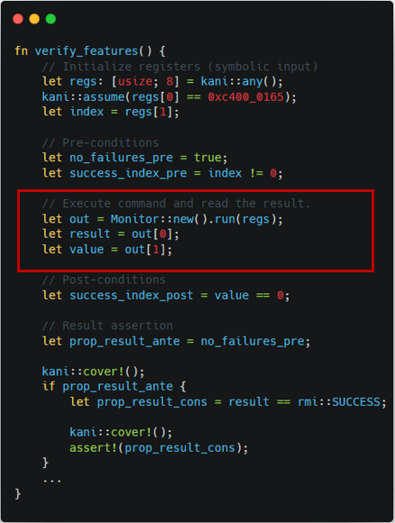
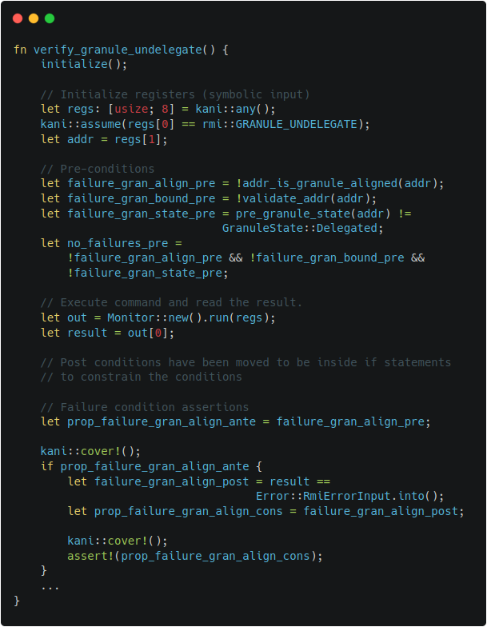

# Islet Verification

## Work done for Islet's Model Checking

### Refactoring for Overall State Reduction

Reducing the overall state is a key technique for model checking,
which often involves computationally infeasible formulas. For this purpose,
we have refactored Islet in the following ways: Array-based Granule Status Table,
Integration of Realm and RD as well as VCPU and REC, and Constraint
Retrieval Modification.

- Array-based Granule Status Table

    We maintain a page table-based Granule Status Table in order to reduce the
overall memory consumption in Islet. This data structure, while being
beneficial in terms of memory usage, was a main obstacle in modeling
checking Islet, because using it would cause a state explosion.
To address this issue, we added an array-based Granule Status Table which
could be selectively chosen with conditional compilation. The intention is
for reducing the overall complexity of page table-based one, helping to
reason about the implementation.

    When the array-based Granule Status Table is chosen, the call sequence could
be largely simplified from the caller's perspective like the below, reducing the
overall state in model checking.

    ```rust
    [before]
    // Previously, the below match was used to expand the page table entry.
    let mut granule = match
        get_granule_if!(addr, GranuleState::Undelegated) {
            Err(MmError::MmNoEntry) => set_state_and_get_granule!(
                addr, GranuleState::Undelegated)
            other => other,
    }?;

    [after]
    // The match is no longer used, as the array will not be expanded.
    let mut granule = get_granule_if!(addr, GranuleState::Undelegated)?;
    ```

- Integration of Realm and RD

    Before the refactoring, Realm and RD (Realm Descriptor) had almost the same
purpose and overlapped functionalities, increasing the overall complexity in
verifying the system. To address this issue, we changed to keep only RD which
is defined by spec.

    The summary of changes is like the below.

    ```rust
    -pub struct Realm {
    -   id: usize,
    -   pub vmid: u16,
    -   pub state: State,
    -   pub vcpus: Vec<Arc<Mutex<VCPU>>>,
    -   pub page_table: Arc<Mutex<Box<dyn IPATranslation>>>,
    -   pub measurements: [Measurement; MEASUREMENTS_SLOT_NR],
    -}

    pub struct Rd {
    -   realm_id: usize,
    +   vmid: u16,
        ...
    +   s2_table: Arc<Mutex<Box<dyn IPATranslation>>>,
        hash_algo: u8,
    +   pub measurements: [Measurement; MEASUREMENTS_SLOT_NR],
    +   pub vcpus: Vec<Arc<Mutex<VCPU>>>,
    }
    ```

    With the change, the call sequence could be largely simplified from
the caller's perspective, reducing the overall state in model checking.

    ```rust
    [before]
       let (s2tte, last_level) = get_realm(realm_id)
              .ok_or(Error::RmiErrorOthers(NotExistRealm))?
              .lock()
              .page_table
              .lock()
              .ipa_to_pte(GuestPhysAddr::from(ipa), level)
              .ok_or(error_code)?;

    [after]
       let (s2tte, last_level) = rd
              .s2_table()
              .lock()
              .ipa_to_pte(GuestPhysAddr::from(ipa), level)
              .ok_or(error_code)?;
    ```

    ```rust
    [before]
       let measurements = crate::realm::registry::get_realm(realmid)
            .ok_or(Error::RmiErrorOthers(NotExistRealm))?
            .lock()
            .measurements;

    [after]
       let measurements = rd.measurements;
    ```


- Integration of VCPU and REC

    Before the refactoring, VCPU and REC (Realm Execution Context) had
almost the same purpose and overlapped functionalities, increasing the
overall complexity in verifying the system. To address this issue, we
changed to keep only REC which is defined by spec.

    The summary of changes is like the below.

    ```rust
	-pub struct VCPU {
	-    pub context: Context,
	-    pub state: State,
	-    pub pcpu: Option<usize>,
	-    me: Weak<Mutex<Self>>,
	-}

	+[repr(C)]
	pub struct Rec<'a> {
	+   pub context: Context,
	    attest_state: RmmRecAttestState,
	...
	-   state: RecState,
	+   state: State,
	    ripas: Ripas,
	    vtcr: u64,
	    host_call_pending: bool,
    }
    ```

    With the change, the call sequence could be largely simplified from the caller's
perspective, reducing the overall state in model checking.

    ```rust
    [before]
        let pa_offset = get_reg(rd, vcpuid, 2)?;
        let buffer_size = get_reg(rd, vcpuid, 3)?;

    [after]
        let pa_offset = get_reg(rec, 2)?;
        let buffer_size = get_reg(rec, 3)?;
    ```

    ```rust
    [before]
    pub fn get_reg(rd: &Rd, vcpu: usize, register: usize) -> Result<usize, Error> {
        ...
        let value = rd
            .vcpus
            .get(vcpu)
            .ok_or(Error::RmiErrorOthers(NotExistVCPU))?
            .lock()
            .context
            .elr;
        ...
    }

    [after]
    pub fn get_reg(rec: &Rec<'_>, register: usize) -> Result<usize, Error> {
        ...
        let value = rec.context.elr;
        ...
    }
    ```

- Constraint Retrieval Modification

	We refactored constraint retrieval procedure of RMI and RSI. The main motivation
of the refactoring is that insertion and get in the map are very expensive operations
in the formal semantic and thus avoiding them is better if possible. It is
also beneficial for runtime performance, as the previous insertions are no longer
involved. The change assumes that the configuration regarding constraints does not
change at runtime.

	```rust
	[before]
	lazy_static! {
    	static ref CONSTRAINTS: BTreeMap<Command, Constraint> = {
        	let mut m = BTreeMap::new();
	        m.insert(rmi::VERSION, Constraint::new(rmi::VERSION, 1, 1));
	...
	(caller)
    	 if let Some(c) = CONSTRAINTS.get(&cmd) {

	[after]
	fn pick(cmd: Command) -> Option<Constraint> {
    	let constraint = match cmd {
        	rmi::VERSION => Constraint::new(rmi::VERSION, 1, 1),
	...
	(caller)
    	if let Some(c) = pick(cmd) {
	```


- The Summary of Refactoring

    Table 1 summarizes the number of physical lines of code involved
    by the refactoring.

    | The Type of Refactoring           | Addition  | Deletion  | Total     |
    | --------------------------------- | --------- | --------- | --------- |
    | Array-based Granule Status Table  | 621       | 367       | 988       |
    | Integration of RD and Realm       | 342       | 442       | 784       |
    | Integration of VCPU and REC       | 311       | 564       | 875       |
    | Constraint Retrieval Modification | 49        | 133       | 182       |
    | Total                             | 1323      | 1506      | 2829      |
    | Table 1. Line Counts of the Refactoring |


### Writing Harnesses

A harness is an essential component in model checking as it provides the
entry point and prepares for the system execution (e.g., global state
initialization). It acts as a bridge between the model checker and the
system under verification, allowing the model checker to access the the
system's inputs and outputs. The harness ensures that the correct input
values are provided to the system and captures the corresponding output
responses. Also, the harness can contain the behaviors of the system to
validate.

In writing harnesses, we adopt the same input and output conditions as well
as similar structures used in [TF-RMM](https://www.trustedfirmware.org/projects/tf-rmm/)'s
harnesses which are extracted from Arm's Machine Readable Specification.
We use this approach, because it would help to check the conformance of the
two systems, namely Islet and TF-RMM, written in different languages: Rust and C.
While using the similar structures, we also preserve Islet's unique characteristics
as much as possible. For example, we maintain two different versions of Islet's
`Mainloop` and `Monitor` (one for verification and the other for execution),
so that harnesses can help determine their target ABI's input and output
through `Monitor`'s argument and return value as shown in Figure 1-2.
The other examples of harnesses can be also found in Figure 2-1 and Figure 2-2,
which describe the harnesses for RMI granule undelegate.


  |  
:--------------------------------:|:---------------------------------:
Figure 1-1. TF-RMM features harness  |  Figure 1-2. Islet features harness


  |  
:--------------------------------:|:---------------------------------:
Figure 2-1. TF-RMM granule undelegate harness  |  Figure 2-2. Islet granule undelegate harness


### Embeding Invariants

Formal verification can help to prove interesting invariants to be held
in the entire states. We embed the invariants with `is_valid()` predicate
in target data structures. For example, the below is the specification
about granule's attributes.


Using the specification's conditions, `is_valid()` predicate can be
defined in `Granule` and `Granule Status Table` respectively.
The added predicate ensures that all granule entries in Granule Status
Table are in valid status conforming to the specification.


```rust
impl Granule {
    ...
    #[cfg(kani)]
    pub fn is_valid(&self) -> bool {
        self.state >= GranuleState::Undelegated &&
        self.state <= GranuleState::RTT &&
        // XXX: the below condition holds from beta0 to eac4
        if self.state != GranuleState::Undelegated {
            self.gpt == GranuleGpt::GPT_REALM
        } else {
            self.gpt != GranuleGpt::GPT_REALM
        }
    }
}
```

```rust
impl GranuleStatusTable {
    ...
    #[cfg(kani)]
    pub fn is_valid(&self) -> bool {
        self.entries
            .iter()
            .fold(true, |acc, x| acc && x.lock().unwrap().is_valid())
    }
}
```


### Environment Modeling

Model checking requires an environment model to accurately analyze and
verify system behaviors. By explicitly specifying the environment in
which a system operates, one can ensure that all possible interactions
between the system and its surroundings are considered during verification.
During Islet's model checking, we have modeled EL3 Monitor and Host
Memory to help verify Islet.

- EL3 Monitor Modeling

    **Background**: RMM interacts with EL3 monitor for privileged operations
    (e.g., Granule Partition Table change). While RMM itself is the target of
    verification and is translated by model checker, RMM's environment such as
    EL3 monitor is beyond the scope of verification, thus should be properly
    modeled during verification.

    **The approach we use**: We insert a ghost `gpt` field in a granule's entry
    for tracking GPT's change as shown in Figure 3-1. We also embed EL3's GPT handling
    code in SMC invocation as shown in Figure 3-2.

  |  
:--------------------------------:|:---------------------------------:
Figure 3-1. Ghost gpt field for EL3 Modeling  | Figure 3-2. GPT Handling for EL3 Modeling


- Host Memory Modeling

    **Background**: The Host delegates and undelegates is memory for Realm
    World's usage. To verify RMM, the memory region should be properly modeled.

    **The approach we use**: We model the Host memory as a pre-allocated memory
    region, because it helps to avoid a false-positive related to invalid memory
    accesses. Also, instead of using the same starting address (e.g., 0x8000\_0000),
    we use a mock region filled with non-deterministic contents. It helps to
    address an issue related to the backend CBMC's pointer encoding where the first
    16 bits are used for a pointer object's identifier.

    The relevant implementation of the Host memory is shown as dotted line in
    Figure 4-1, while the pre-allocated mock region as solid line. The checking
    logic regarding valid memory range is also adjusted from dotted line
    (original check) to solid line (modeled check) in Figure 4-2.

  |  
:--------------------------------:|:---------------------------------:
Figure 4-1. Host Memory Modeling (Declaration)  | Figure 4-2. Host Memory Modeling (Check)


## Results

### Steps to Reproduce

- Verification Dependency

    [patched Kani](https://github.com/zpzigi754/kani/tree/use-aarch64-latest)

- Available RMI targets

    ```sh
    rmi_features
    rmi_granule_delegate
    rmi_granule_undelegate
    rmi_realm_activate
    rmi_rec_aux_count
    rmi_rec_destroy
    rmi_version
    ```

- Verifying Islet

    ```sh
    (in islet/model-checking)

    # Choose one among the list in `Available RMI targets` for the value of `RMI_TARGET`
    $ RMI_TARGET=rmi_granule_undelegate make verify
    ```


### Bugs Found

We found four correctness bug and one security bug during Islet's model checking.

- RMI Features

    Figure 5-1 indicates the previous implementation of RMI features. When this code
was passed as an input, the verification failed. It was because the code was
violating the failure conditions of RMI features as shown in Figure 5-2. After
fixing the line returning the error condition, the verification becomes successful.


  |  
:--------------------------------:|:---------------------------------:
Figure 5-1. Buggy RMI Features Code  | Figure 5-2. Failure Conditions of RMI features

- RMI Granule Undelegate

    Figure 6-1 incidates the previous implementation of `set_state()` which modifies the
state of the target granule. It is invoked by several ABIs including RMI granule
undelegate. When this code was used, the verification for RMI granule undelegate
failed. It was because the code was violating the success conditions of RMI granule
undelegate as shown in Figure 6-2. We fixed the code to zero-out the contents
not only in the delegated state but also in the undelegated state, turning the
verification results successful. Note that without the patch, it could have left
sensitive information on the target granule, which might be obtained by attackers.


    ||
    |:--:|
    | Figure 6-1. Buggy RMI Granule Undelegate Code  |

    ||
    |:--:|
    | Figure 6-2. Success Conditions of RMI Granule Undelegate  |

- RMI Rec Destroy

    Figure 7-1 indicates the previous implementation of RMI rec destroy. When this code
was passed as an input, two verification conditions failed. It was because the code was
violating the failure condition as well as the success condition of RMI rec destroy as 
shown in Figure 7-2. After adding the sanitization logic and granule setting code, 
the verification becomes successful.

  | 
:--------------------------------:|:---------------------------------:
Figure 7-1. Buggy RMI Rec Destroy Code  | Figure 7-2. Conditions of RMI Rec Destroy

- RMI Version

    Figure 8-1 indicates the previous implementation of RMI version. When this code
was passed as an input, the verification failed. It was because the code was
not satisfying the conditions for output values (lower and higher) in failure conditions 
of RMI version as shown in Figure 8-2. After setting the output values beforehand, 
the verification becomes successful.

  | 
:--------------------------------:|:---------------------------------:
Figure 8-1. Buggy RMI Version Code  | Figure 8-2. Outputs of RMI Version


### Verification Output

- RMI Features

    Figure 9-1 shows the output of Islet's model checking with the target of
RMI features. It says that the total of 5271 verification conditions and the
total of 4 cover conditions have successfully passed.

    ||
    |:--:|
    | Figure 9-1. Model Checking Output of RMI Features  |

- RMI Granule Delegate

    Figure 9-2 shows the output of Islet's model checking with the target of RMI
granule delegate. It says that the total of 5557 verification conditions and the
total of 14 cover conditions have successfully passed.


    ||
    |:--:|
    | Figure 9-2. Model Checking Output of RMI Granule Delegate  |

- RMI Granule Undelegate

    Figure 9-3 shows the output of Islet's model checking with the target of RMI
granule undelegate. It says that the total of 5559 verification conditions and
the total of 14 cover conditions have successfully passed.


    ||
    |:--:|
    | Figure 9-3. Model Checking Output of RMI Granule Undelegate  |

- RMI Realm Activate

    Figure 9-4 shows the output of Islet's model checking with the target of RMI
realm activate. It says that the total of 5584 verification conditions and
the total of 12 cover conditions have successfully passed.

    ||
    |:--:|
    | Figure 9-4. Model Checking Output of RMI Realm Activate  |

- RMI Rec Aux Count

    Figure 9-5 shows the output of Islet's model checking with the target of RMI
rec aux count. It says that the total of 5495 verification conditions and
the total of 10 cover conditions have successfully passed.

    ||
    |:--:|
    | Figure 9-5. Model Checking Output of RMI Rec Aux Count  |

- RMI Rec Destroy

    Figure 9-6 shows the output of Islet's model checking with the target of RMI
rec destroy. It says that the total of 5610 verification conditions and
the total of 14 cover conditions have successfully passed.

    ||
    |:--:|
    | Figure 9-6. Model Checking Output of RMI Rec Destroy  |

- RMI Version

    Figure 9-7 shows the output of Islet's model checking with the target of RMI
version. It says that the total of 5468 verification conditions and
the total of 3 cover conditions have successfully passed.

    ||
    |:--:|
    | Figure 9-7. Model Checking Output of RMI Version  |
