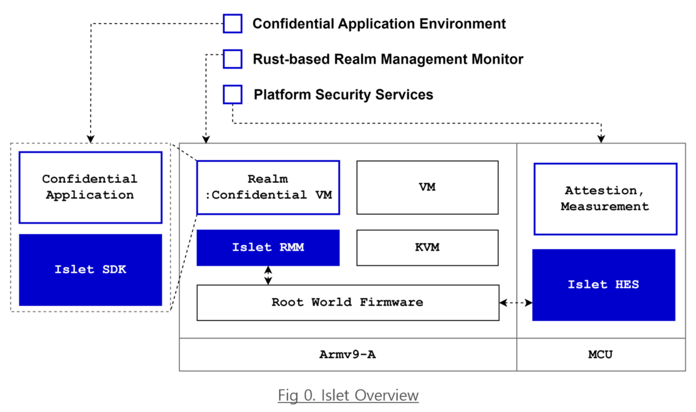
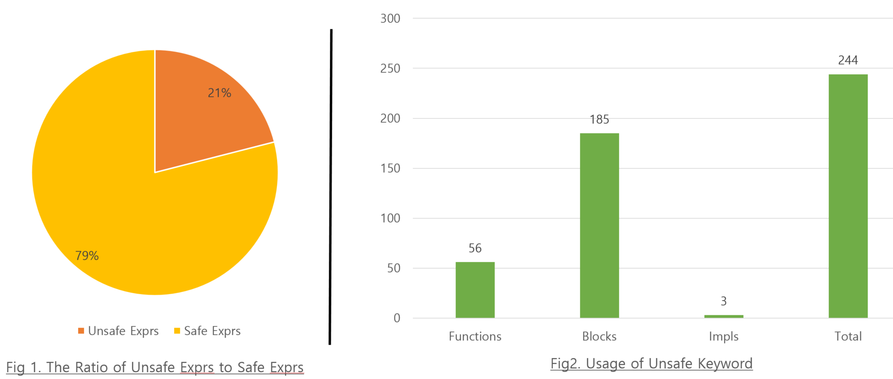
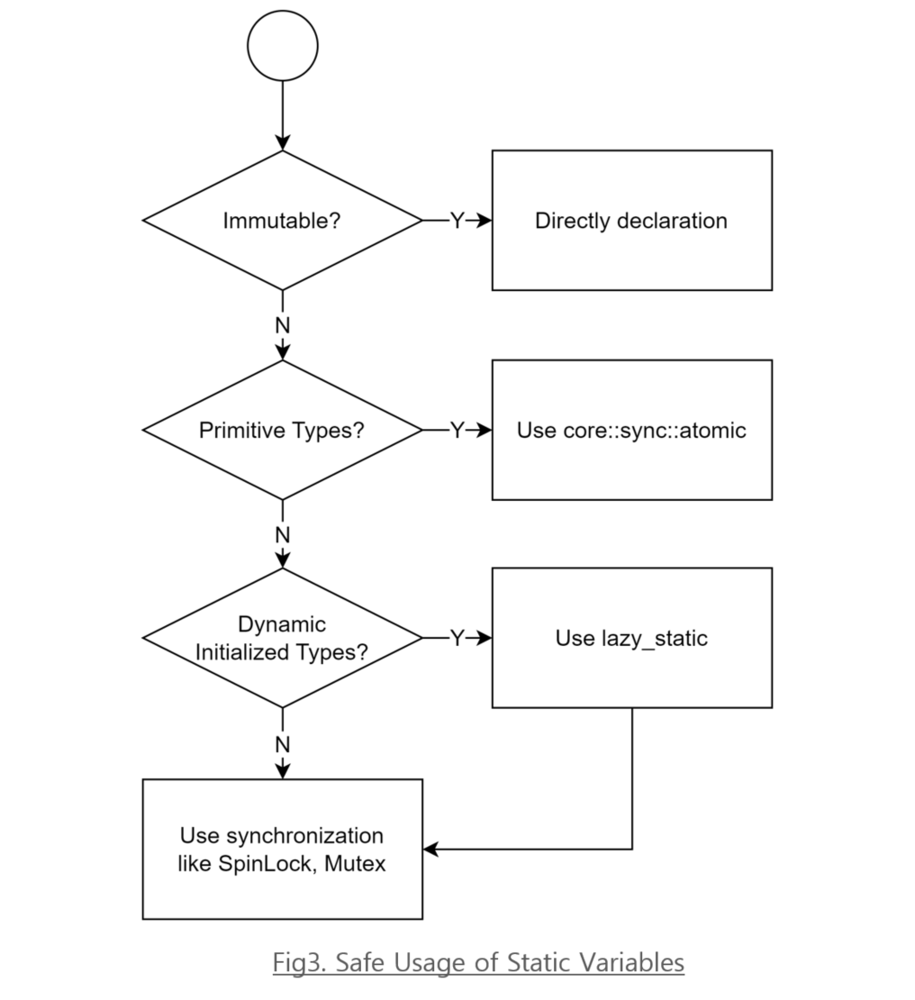
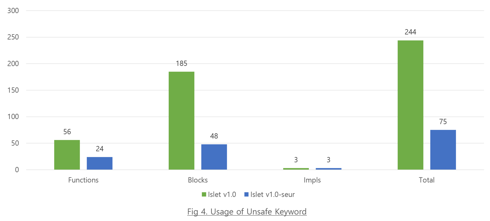
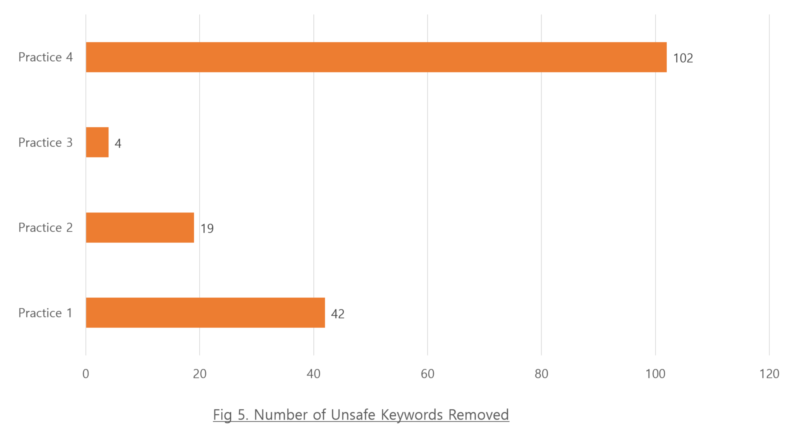

# Safety Enhancements of Unsafe Rust

## Overview <a name="overview"></a>

### **Islet: An On-Device Confidential Computing Platform**

Islet is an open-source project written in Rust
that enables confidential computing on ARM architecture devices using the ARMv9 CCA \[0\].
Islet consists of the two main components and a sdk (refer to Fig. 0).
The `RMM` operates at EL2 in the Realm world on the application processor cores
and manages the confidential VMs, known as realms.
The `HES` performs device boot measurement, generates platform attestation reports,
and manages sealing key functionality within a secure hardware IP
apart from the main application processor.
The `SDK` provides confidential computing primitives to applications in the realms.

<p align="center"></p>

Due to its nature of operating at EL2,
the RMM requires the use of Rust's `unsafe` syntax.
This activity focuses on minimizing the use of `unsafe` code
and finding design improvements to enhance safety.

### **Rust and Unsafe Rust**

**Rust** is a systems programming language that offers several key advantages \[1\]:

- Memory Safety: Rust guarantees memory safety through its ownership system,
  which enforces strict borrowing rules and eliminates many common programming errors
  such as null pointer dereferencing, buffer overflows, and use-after-free bugs.
  This makes Rust particularly well-suited for systems programming,
  where these types of errors can lead to significant issues.

- Concurrency: Rust's ownership model also aids in safe concurrency.
  By enforcing rules at compile-time, Rust ensures that data races are impossible,
  making concurrent programming safer and more reliable compared to traditional languages.

- Performance: Rust provides performance comparable to C and C++ due to its low-level control
  over hardware and lack of a garbage collector. This makes it an ideal choice
  for performance-critical applications such as operating systems, game engines,
  and real-time simulations.

- Modern Tooling: Rust comes with a robust set of tools, including a package manager (Cargo),
  a build system, and integrated testing frameworks, which streamline the development process
  and enhance productivity.

These advantages make Rust particularly suitable for projects that require
both security and performance, such as embedded systems and hypervisors.

**Unsafe Rust** is needed for implementing Islet RMM operating at EL2.
Tasks such as interfacing with hardware, manipulating raw pointers,
and performing certain optimizations require the use of `unsafe` code \[2\].
Since `unsafe` code operates outside Rust's safety guarantees,
minimizing the use of `unsafe` code is crucial
to reduce the risk of security vulnerabilities and bugs.
Also, Formal verification tools, used to mathematically prove the correctness of programs,
typically focus on safe code \[3\].
These tools rely on Rust's safety guarantees to build their proofs.
This limitation highlights the need to minimize and mitigate `unsafe` code usage.

To address the risks associated with `unsafe` code,
finding and implementing best practices that reduce reliance on `unsafe` operations are essential.
This includes creating safe abstractions, rigorously reviewing `unsafe` code,
and leveraging Rust's ownership and type systems.
By doing so, developers can ensure that `unsafe` code is used correctly and safely,
reducing the risk of errors and improving the overall robustness of the codebase.

## Code Analysis <a name="code-analysis"></a>

Using a source code analysis tool \[4\],
we analyzed the Islet RMM v1. Based on expressions,
the ratio of `unsafe` code is 21% (refer to Fig. 1).
When categorized according to the keyword,
the total number of keywords used is 244,
with 185 `unsafe` blocks,
56 `unsafe` functions,
and 3 `unsafe` trait implementations.



## Code Improvement <a name="code-improvement"></a>

To improve `unsafe` code usage,
we categorized the RMM's `unsafe` code according to the usage purposes
outlined in \"How do programmers use unsafe rust?\"
and identified practices for improvement \[5\].
As a result, we defined **four practices** related to improve `unsafe` code.
These practices address the root causes of `unsafe` code usage
and provide structured methods to improve the safety and reliability of the codebase.

### **Practice 1: Representation of data structures defined by the specification <a name="practice1"></a>**

**Cause**: Use of `union` to match the offset in data structures as defined
by the specification \[6\].
Using `union` is considered risky because it allows interpreting
the same data in multiple incompatible ways, bypassing Rust's strict type safety guarantees.  
*(Security Impact: Misinterpreting data can lead to undefined behavior, memory corruption, and potential security vulnerabilities such as buffer overflows and data leaks.)*

```rust
#[repr(C)]
struct EntryInner {
   flags: Flags,
   gprs: GPRs,
   gicv3: EntryGICv3,
}

#[repr(C)]
union Flags {
   val: u64,
   reserved: [u8; 0x200],
}

pub unsafe fn entry_flags(&self) -> u64 {
   self.entry.inner.flags.val
}
```

**Solution**: Replace `union` with `padded structures` to align offsets correctly while maintaining safe code practices.

```rust
pad_struct_and_impl_default!(
struct Entry {
    0x0   flags: u64,
    0x200 gprs: [u64; NR_GPRS],
    0x300 gicv3_hcr: u64,
    0x308 gicv3_lrs: [u64; NR_GIC_LRS],
    0x800 => @END,
}
);
```

### **Practice 2: Conversion of Data Structures Shared Between Execution Environments <a name="practice2"></a>**

**Cause**: The process of converting raw pointers to data structures shared
across different execution environments (e.g., Realm World and Host World).
Raw pointers bypass Rust's borrowing rules, which can lead to data races, null dereferencing,
and other forms of undefined behavior.  
*(Security Impact: Risky conversions can result in memory safety violations, leading to data corruption, crashes, and potential exploitation by malicious code.)*

```rust
pub unsafe fn init(config_addr: usize, ipa_width: usize) {
        let config: &mut RealmConfig = &mut *(config_addr as *mut RealmConfig);
        config.ipa_width = ipa_width;
}
```

**Solution**: Implement safe abstractions and conversion functions to ensure type safety and prevent undefined behavior during data structure conversions.

```rust
pub fn init(config_addr: usize, ipa_width: usize) -> Result<(), Error> {
   Ok(assume_safe::<RealmConfig>(config_addr)
      .map(|mut realm_config| realm_config.ipa_width = ipa_width)?)
}
```

### **Practice 3: Instance Management for Global Lifetimes <a name="practice3"></a>**

**Cause**: Use of `unsafe` code for managing instances that need to persist
for the global lifetime of the application.
Managing global instances with mutable statics can lead to unsynchronized access
and race conditions, violating Rust's concurrency guarantees.
*(Security Impact: Race conditions can lead to unpredictable behavior, data corruption, and vulnerabilities exploitable by attackers to cause denial of service or execute arbitrary code.)*

```rust
pub static mut GRANULE_STATUS_TABLE: Option<GranuleStatusTable> = None;

pub fn create_granule_status_table() {
    unsafe {
        if GRANULE_STATUS_TABLE.is_none() {
            GRANULE_STATUS_TABLE = Some(GranuleStatusTable::new());
        }
    }
}
```

<p align="center"></p>

**Solution**: Define flowcharts to use mutable static variables safely by leveraging Rust's idiom (refer to Fig. 3).

```rust
lazy_static! {
    pub static ref GRANULE_STATUS_TABLE: GranuleStatusTable = GranuleStatusTable::new();
}
```

### **Practice 4: Policies for Accessing System Registers <a name="practice4"></a>**

**Cause**: Direct access to system registers often requires `unsafe` operations.
System registers control hardware state and system behavior.
Incorrect handling can bypass security mechanisms and lead to undefined behavior.
*(Security Impact: Risky access to system registers can compromise the system's stability and security, leading to potential privilege escalation or hardware malfunction.)*

```rust
pub fn save_state(vcpu: &mut VCPU<Context>) {
   ...

    *&mut gic_state.ich_vmcr_el2 = unsafe { ICH_VMCR_EL2.get() };
    *&mut gic_state.ich_hcr_el2 = unsafe { ICH_HCR_EL2.get() };
    *&mut gic_state.ich_misr_el2 = unsafe { ICH_MISR_EL2.get() };

    unsafe { ICH_HCR_EL2.set(gic_state.ich_hcr_el2 & !ICH_HCR_EL2_EN_BIT) };
}
```

**Solution**: Contribute the necessary registers to the open-source project
that is the de facto standard in Rust, which applies safe abstractions
to system register access \[7\].
Use this project for accessing system registers safely.
If accessing certain system registers is critical to memory safety, it must be exposed as `unsafe`.

```rust
use aarch64_cpu::registers::*;

pub fn save_state(rec: &mut Rec<'_>) {
    ...

    gic_state.ich_vmcr_el2 = ICH_VMCR_EL2.get();
    gic_state.ich_hcr_el2 = ICH_HCR_EL2.get();
    gic_state.ich_misr_el2 = ICH_MISR_EL2.get();

    ICH_HCR_EL2.set(gic_state.ich_hcr_el2 & 
      !(ICH_HCR_EL2::En.mask << ICH_HCR_EL2::En.shift));
}
```

## Key Results <a name="key-results"></a>

### **KR1: Reduction in Unsafe Keywords**

We have enhanced the overall robustness and maintainability of our project.
Notably, Islet v1.0 had 244 `unsafe` keywords,
which have been reduced to 75 in Islet v1.0-seur,
Version 1.0 Safety Enhancements of Unsafe Rust,
Resulting in an approximately 70% reduction (refer to Fig. 4).



### **KR2: Best Practices for Improving Unsafe Code**

We have also defined four best practices for improving `unsafe` code.
These practices provide clear guidelines for developers to follow,
ensuring the consistent application of safe coding principles across the project.
[In Practice 1](#practice1), 42 `unsafe` keywords were removed \[8\].
[In Practice 2](#practice2), 19 `unsafe` keywords were removed \[9\].
[In Practice 3](#practice3), 4 `unsafe` keywords were removed \[10\].
[In Practice 4](#practice4), 102 `unsafe` keywords were removed \[11\].
Due to code changes since Islet v1.0,
only explicitly removed keywords were counted (refer to Fig. 5).
The remaining 75 `unsafe` keywords are associated with accessing local registers
and internally managed structures within RMM, such as converting raw pointers for page tables.



### **KR3: Development a new library (safe-abstraction)**

For Practice 2, safe_abstraction crate was developed.
The safe_abstraction library is designed to facilitate safer abstraction
over `unsafe` code, aiming to enhance the safety and maintainability of Rust code,
especially when dealing with `unsafe` code blocks \[12\].

### **KR4: Integration of Source Code Analysis Tool**

We have integrated a source code analysis tool, cargo-geiger, into our CI pipeline.
This tool automates the detection and monitoring of `unsafe` code,
allowing us to maintain code safety and quickly identify areas that require attention.

### **KR5: Contribution to Open Source Project**

Currently, we are in the process of contributing
to the open-source project `rust-embedded/aarch64-cpu` \[13\].
This contribution aims to extend the capabilities of this widely-used project,
ensuring that it includes the necessary registers and applies safe abstractions
to system register access, further promoting safe coding practices in the Rust community.

## Conclusion

In this report, we have resulted in a notable reduction of `unsafe` keywords by approximately 70%.
This achievement underscores our commitment to minimizing `unsafe` code
and improving overall code quality.
We have also defined four best practices for improving `unsafe` code.
Additionally, we have integrated a source code analysis tool, cargo-geiger,
into our CI pipeline, allowing us to maintain code safety through automated detection
and monitoring of `unsafe` code.

One of our key initiatives, the development of a new library to aid in the safe design
and use of raw pointers, further demonstrates our proactive approach to improving code safety.
This library specifically addresses the needs identified in Practice 2,
ensuring safer data structure conversions.

Lastly, our ongoing contribution to the `rust-embedded/aarch64-cpu` open-source project
aims to extend the capabilities of this widely-used project,
promoting safe coding practices in the Rust community by incorporating necessary registers
and applying safe abstractions.

By addressing the root causes of `unsafe` code and implementing structured improvement practices,
we have minimized the use of `unsafe` of the Islet codebase.
Our goal is to ensure that the Islet project remains a benchmark for safe
and reliable software in the field of confidential computing.


### Future Work

Moving forward, our efforts will focus on the following areas to further enhance the safety
and robustness of the Islet codebase:

1. Tool Integration and Improvement: Continue to integrate rust safety tools like `MIRI`
  in our CI pipeline to automate the detection of `unsafe` code
  and maintain high safety standards \[14\].
2. Ongoing Audits: Regularly audit the codebase to identify and address new instances of 
  `unsafe` code, ensuring continuous improvement in code safety.
3. Community Contribution: Actively contribute to the open-source community,
  particularly projects like `rust-embedded/aarch64-cpu`,
  to promote the use of safe abstractions and enhance collaborative development efforts.

## Reference
\[0\] [Islet: An On-Device Confidential Computing Platform](https://github.com/islet-project/islet)  
\[1\] [Rust: A language empowering everyone to build reliable and efficient software.](https://www.rust-lang.org/)  
\[2\] [The unsafe keyword, The Rust Reference](https://doc.rust-lang.org/reference/unsafe-keyword.html)  
\[3\] [RustBelt: securing the foundations of the Rust programming language, ACM, 2017](https://dl.acm.org/doi/10.1145/3158154)  
\[4\] [A tool that lists statistics related to the usage of unsafe Rust code](https://github.com/geiger-rs/cargo-geiger)  
\[5\] [How do programmers use unsafe rust?, ACM, 2020](https://dl.acm.org/doi/10.1145/3428204)  
\[6\] [Realm Management Monitor Specification](https://developer.arm.com/documentation/den0137/latest/)  
\[7\] [aarch64-cpu: Low level access to processors using the AArch64 execution state](https://github.com/rust-embedded/aarch64-cpu)  
\[8\] Practice 1: Representation of data structures defined by the specification  
 https://github.com/islet-project/islet/pull/295
 https://github.com/islet-project/islet/pull/286  
\[9\] Practice 2: Conversion of Data Structures Shared Between Execution Environments  
 https://github.com/islet-project/islet/pull/297
 https://github.com/islet-project/islet/pull/298
 https://github.com/islet-project/islet/pull/332  
\[10\] Practice 3: Instance Management for Global Lifetimes  
 https://github.com/islet-project/islet/pull/279  
\[11\] Practice 4: Policies for Accessing System Registers  
 https://github.com/islet-project/islet/pull/331  
\[12\] [Islet: Safe Abstraction Crate](https://github.com/islet-project/islet/tree/main/lib/safe-abstraction)  
\[13\] [aarch64-cpu: Add multiple registers and update fields](https://github.com/rust-embedded/aarch64-cpu/pull/27)  
\[14\] [MIRI:An interpreter for Rust's mid-level intermediate representation](https://github.com/rust-lang/miri)
