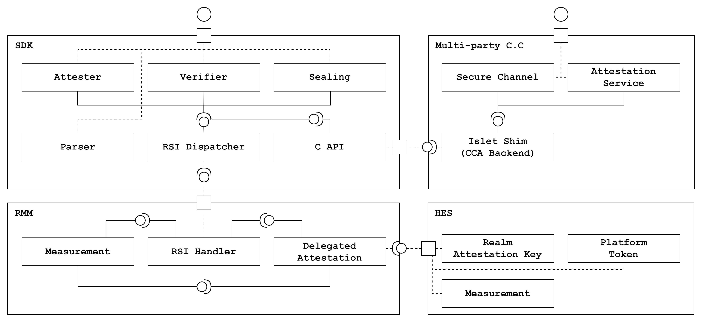
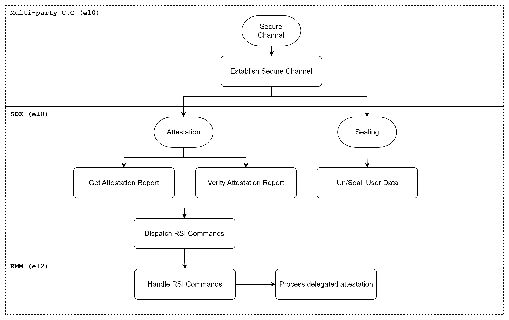

# SDK Software Design Document

## Table of Contents
1. [SDK Introduction](#introduction)
2. [System Architecture](#system-architecture)
3. [APIs and Interfaces](#apis-interfaces)
4. [Functional Requirements](#functional-requirements)
5. [Non Functional Requirements](#non-functional-requirements)
6. [Testing Strategy](#testing-strategy)
7. [Conclusion](#conclusion)

## 1. SDK Introduction 
### Overview
This Software Design Document outlines
the architecture and functionality of the SDK,
which provides confidential computing features for realm developers.
The SDK aims to offer a set of tools and APIs that enable those features within realms.
The SDK encompasses the following key features:

- **Attestation**
  - The ability to verify the authenticity and integrity of data, actions, or entities within realms
  - Established this feature securely with our own HES(Hardware enforced security)
- **Secure Channel**
  - Securely data transmission that is resistant to overhearing and tampering
  - Collaborated with [the multi-part C.C. Framework](https://github.com/vmware-research/certifier-framework-for-confidential-computing)
- **Sealing**
  - Securely storing and protecting sensitive data to prevent unauthorized access and tampering
  - Provided this feature in a simulated version

### Limitation
SDK provieds sealing features only simulated version.

## 2. System Architecture 
### Component Structure
The SDK follows a modular architecture. The architecture comprises:
- **Attester Module**: Retrieves the attestation report generated by RMM.
- **Verifier Module**: Incorporates the logic for the realm token and platform token verification.
- **Parser Module**: Provides parsing specific claims of the attestation report.
- **Sealing Module**: Implements encryption functions in compliance with the multi-part C.C. framework
- **C API Module**: Provides C APIs for the multi-part C.C. Framework to achieve secure channel functionality.
- **RSI Dispatcher Module**: Dispatches RSI commands to RMM and get results from RMM 

To support `secure channel`
the C API module exposes `attester, verifier and sealing modules` to the multi-part C.C framework.
Islet SDK interacts with several components to provide C.C. primitives securely.
The detailed SDK component and connector view is shown below.

*NOTE: Delegated attestation module of Islet RMM works in progress.
SDK uses [the reference RMM](https://www.trustedfirmware.org/projects/tf-rmm/) now,
which means SDK is loosely coupled with RMM.*

### Security Considerations
The SDK complies with [the Arm CCA RMM specification](https://www.arm.com/architecture/security-features/arm-confidential-compute-architecture) and [the CCA Security Model](https://documentation-service.arm.com/static/610aaec33d73a34b640e333b?token=).
According to the recommendation, Security Model R0004, SDK utilizes our own HES-enabled system.

## 3. APIs and Interfaces 
The SDK provides the following interfaces:
- Rust APIs for attestation and sealing
- C APIs to multi-part C.C. framework for secure channel
- Low-level interfaces to RMM for the RSI dispatcher

The realm developers can use Rust APIs and C APIs directly for attestation and sealing.
The realm developers can use multi-part C.C. framework for secure channel.
Low-level interfaces are abstracted to communicate between RMM and SDK internally.

The below diagram shows how API calls flow.

## 4. Functional Requirements 
The SDK defines functional requirements to provide C.C. primitives.
Function requirements cover Rust APIs, CAPIs and internal interfaces.
The APIs should be tested using [Testing Strategy](#testing-strategy).

| No  | Name                                      | Description                                                                               |
| --- | ----------------------------------------- | ----------------------------------------------------------------------------------------- |
| FR1 | Attestation Report Generation             | The SDK must provide methods to get a CCA attestation report                              |
| FR2 | Attestation Report Verification           | The SDK must provide methods to verify a CCA attestation report                           |
| FR3 | Attestation Report Parser                 | The SDK must provide methods to parse a CCA attestation report                            |
| FR4 | Simulated Attestation Report Generation   | The SDK must provide methods to get a CCA attestation report (simulated ver x86_64)       |
| FR5 | Simulated Attestation Report Verification | The SDK must provide methods to verify the CCA attestation report  (simulated ver x86_64) |
| FR6 | Simulated Sealing                         | The SDK must provide methods to seal user data (simulated on x86_64)                      |
| FR7 | Simulated Unsealing                       | The SDK must provide methods to unseal sealed user data (simulated on x86_64)             |
| FR8 | Secure Channel                            | The SDK must provide methods to secure channel using multi-part C.C framework             |
| FR9 | RSI Dispatcher                            | The SDK must provide methods to dispatch RSI commands to RMM                              |

## 5. Non-Functional Requirements 
The SDK defines non functional requirements as compliance standards.
The standards include the CCA RMM spec, the CCA Security Model and the multi-part C.C framework.

| No   | Name             | Description                                                                         |
| ---- | ---------------- | ----------------------------------------------------------------------------------- |
| NFR1 | Compliance       | Adheres to the Arm CCA specification                                                |
| NFR2 | Unit Testing     | Comprehensive unit testing for all SDK components                                   |
| NFR3 | Deployment       | Provides guidelines for deploying the SDK to multi-part C.C framework               |
| NFR4 | RMM Independency | Makes loose coupling with RMM to support other spec compliant RMM                   |

## 6. Testing Strategy 
The SDK provides our own unit tests for Rust APIs(Attestation and Sealing).
The SDK provides [the test code](https://github.com/vmware-research/certifier-framework-for-confidential-computing/tree/main/src/islet/islet_test) to the multi-party C.C framework for C APIs(Attestation and Sealing) and secure channel.

### Attestation
- Components
  - Islet SDK unit tests
  - Multi-part C.C. framework test applications
- Related FRs
  - FR1. Attestation Report Generation
  - FR2. Attestation Report Verification
  - FR3. Attestation Report Parser
  - FR4. Simulated Attestation Report Generation
  - FR5. Simulated Attestation Report Verification
- Validation methods
  - Rust APIs should be passed by SDK unit tests on both x86_64 and aarch64 systems.
  - C APIs should be worked with the multi-part C.C. framework on both x86_64 and aarch64 systems.

### Sealing
- Components
  - Islet SDK unit tests
  - Multi-part C.C framework test applications
- Related FRs
  - FR6. Simulated Sealing
  - FR7. Simulated Unsealing
- Validation methods
  - Rust APIs should be passed by SDK unit tests on the x86_64 system.
  - C APIs should be worked with the multi-part C.C. framework on the x86_64 system.

### Secure Channel
- Components
  - Islet SDK unit tests
  - Multi-part C.C Framework test applications
  - Multi-part C.C Framework attestation service
- Related FRs
  - FR8. Secure Channel
- Validation methods
  - C APIs should be worked with the multi-part C.C. framework on both x86_64 and aarch64 systems.
  
## 7. Conclusion 
This Software Design Document provides a comprehensive overview of the SDK's architecture, functionality, functional and non-functional requirements for utilizing attestation, sealing and secure channel features on realms.
