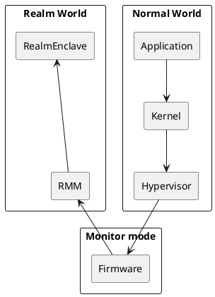

# Chapter 1

This project supports confidential computing based on the ARM CCA architecture.

```plantuml
@startuml
skinparam monochrome true
top to bottom direction
rectangle "Normal World" {
    rectangle Hypervisor
    rectangle Kernel
    rectangle Application

    Application -d-> Kernel
    Kernel -d-> Hypervisor
}

rectangle "Realm World" {
    rectangle RMM
    rectangle RealmEnclave

    RMM -u--> RealmEnclave
}

rectangle "Monitor mode" {
    rectangle Firmware
}
Hypervisor -d-> Firmware
Firmware -u-> RMM
@enduml
```
