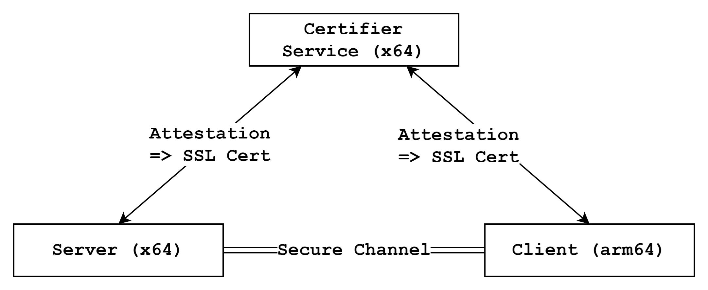

# Cross-platform End-To-End Encryption (E2EE)

## E2EE with attestation

E2EE is a type of communication security that
ensures only the intended recipients can
read the messages being sent and received.
This example demonstrates
how to integrate remote attestation validation
into the E2EE establishment process
using the [Certifier Framework](https://github.com/vmware-research/certifier-framework-for-confidential-computing).
Our example extends the framework's [sample application](https://github.com/vmware-research/certifier-framework-for-confidential-computing/tree/main/sample_apps/simple_app_under_islet)
to demonstrate E2EE between x64 and arm64 platforms.

## Components
This example consists of three main components:



- Certifier Service: An x64 service responsible for performing attestation and checking against a pre-written policy
- E2EE Server App: An x64 application that requests attestation to the service and attempts to establish a secure channel with the client
- E2EE Client App: An arm64 application that requests attestation to the service and attempts to establish a secure channel with the server

## Helper Scripts
We provide several helper scripts to simplify building and running the example:
- setup.sh: Installs required dependencies such as protobuf and gflags
- provisioning.sh: Configures the necessary measurements and policies for the service, server, and client
- build-{service, server, client}.sh: Builds each component separately
- run-{service, server, client}.sh: Starts each component separately

## How to run this example
### 1. Install Dependencies
First, navigate to the examples directory and
execute the setup script to install required dependencies:
```sh
$ cd $(islet)/examples/cross-platform-e2ee
$ ./setup.sh
```

### 2. Configure Measurements and Policies
Next, configure the necessary measurements and
policies by editing the `provisioning.sh` script and
specifying your own values for the following variables:
*Those instructions are quoted from [well-descripted document](https://github.com/vmware-research/certifier-framework-for-confidential-computing/blob/main/sample_apps/simple_app_under_islet/instructions.md)*

```
# Set your measurements
SERVER_MEASUREMENT=580bd77074f789f34841ea9920579ff29a59b9452b606f73811132b31c689da9
CLIENT_MEASUREMENT=491cf94bdb951308672a839776359d6ac22808bad2d318226ef0ea2979693e2e
```

Once you have edited the script,
run it to generate the necessary keys and certificates:

```sh
$ ./provisioning.sh
...
...
3 blocks
1: Key[rsa, policyKey, b1a4dd71c6ea998df84b84689acb3b2eece897ca] says Key[rsa, policyAuthority, b1a4dd71c6ea998df84b84689acb3b2eece897ca] is-trusted-for-attestation
2: Key[rsa, policyKey, b1a4dd71c6ea998df84b84689acb3b2eece897ca] says Measurement[580bd77074f789f34841ea9920579ff29a59b9452b606f73811132b31c689da9]  is-trusted
3: Key[rsa, policyKey, b1a4dd71c6ea998df84b84689acb3b2eece897ca] says Measurement[491cf94bdb951308672a839776359d6ac22808bad2d318226ef0ea2979693e2e]  is-trusted
```

### 3. Run network enabled FVP
The client runs on the FVP,
so you need to enable networking on FVP
before starting the client.
Follow these steps to do so:
*For more information about the network setting
refer [this](https://samsung.github.io/islet/network.html).*

```sh
$ cd $(islet)
$ ./scripts/fvp-cca --normal-world=linux-net --realm=linux --hes
```

Then, in the host Linux environment on FVP, launch the realm:

```sh
$ ./launch-realm.sh net
```

Finally, in the realm Linux environment on FVP,
set the realm IP address and
load the RSI kernel module:

*You have to set current host machine time on realm linux.
Because the service issues SSL certificates
based host machine time
to the server and the client*

```sh
$ cd /shared
$ ./set-realm-ip.sh
$ date ${CURRENT_HOST_MACHINE_TIME} // ex) 122112002023
$ insmod rsi.ko
```

### 4. Build components
Now that you've configured everything,
build the components using the provided build scripts:

```sh
// Compile the service
$ ./build-service.sh

// Compile the client
$ ./build-server.sh

// Cross-compile the client
$ ./build-client.sh
```

### 5. Run components
With all components built, you're ready to start them:

Open three separate terminal windows or tabs.
In the first window, start the certifier service:
 
```sh
$ ./run-service.sh
```

In the second window, start the server app:

```sh
$ ./run-server.sh
```

In the third window,
switch to the /shared directory on FVP and start the client app:

```sh
$ cd /shared
$ ./run-client.sh
```

That's it!
Now you may see the server and client
successfully establish an end-to-end encrypted connection.
