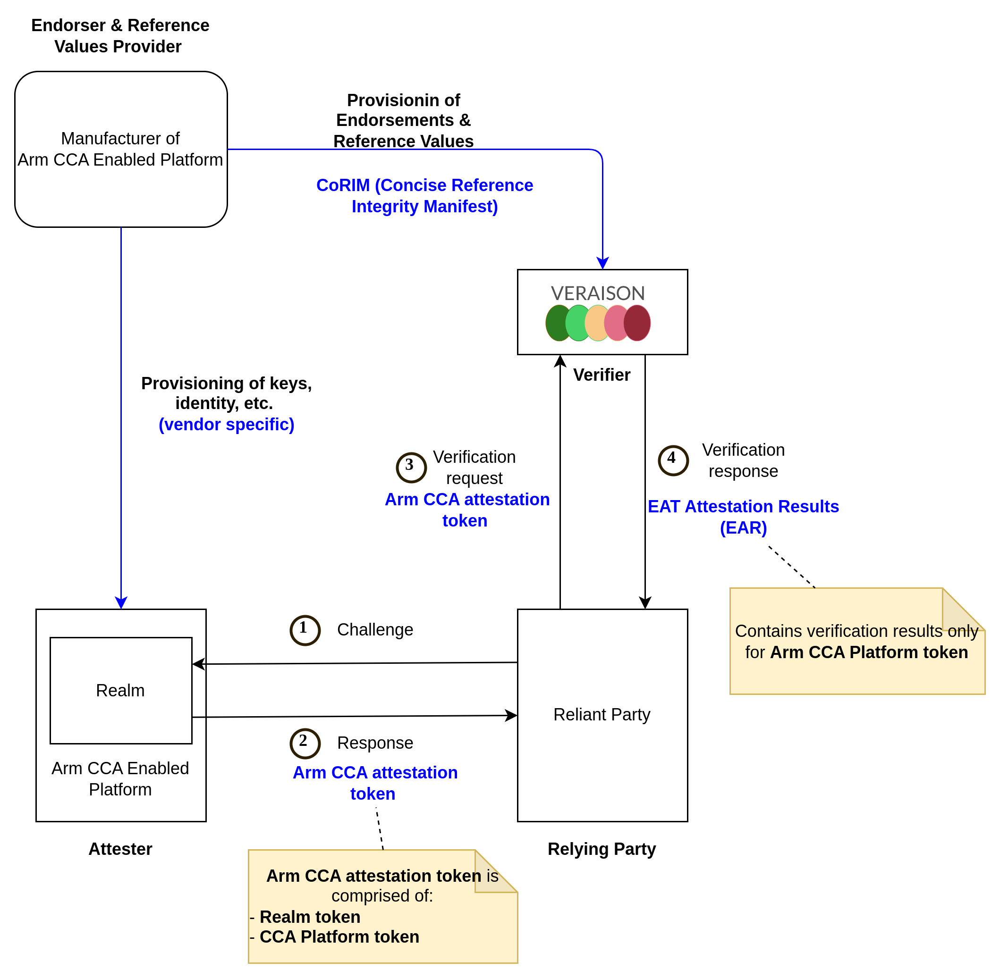
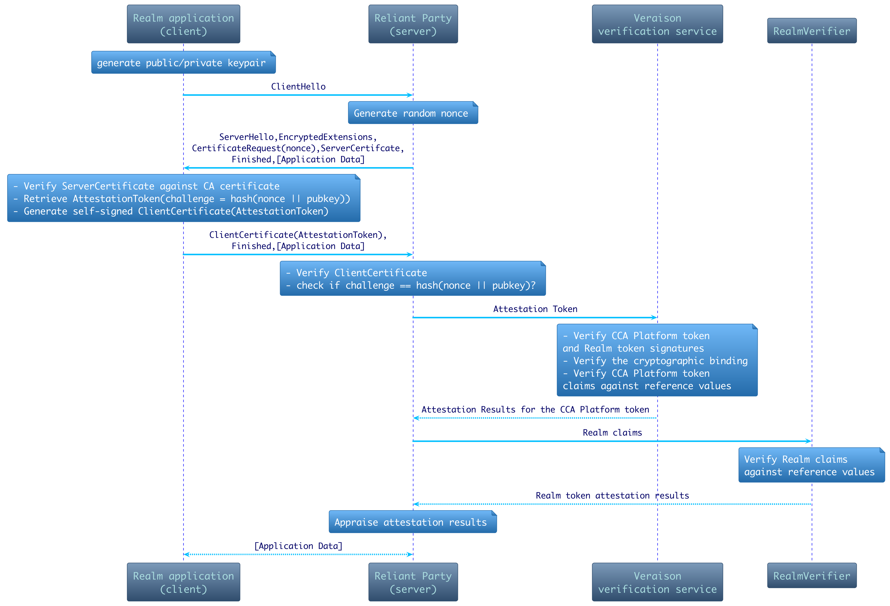
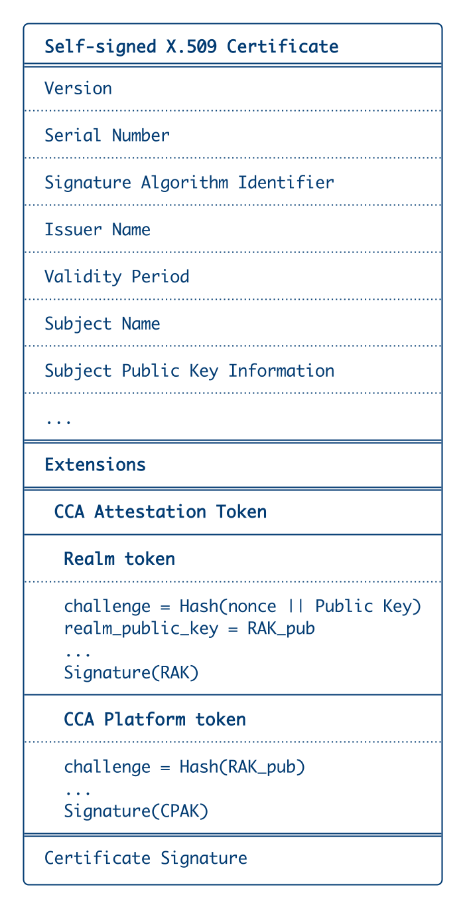
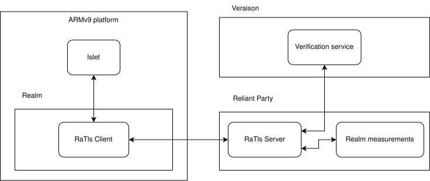

# Remote attestation

## Introduction

Remote attestation is the process of proving that a remote system of interest possesses certain properties. This is achieved by having the system produce attestation evidence in the form of signed claims, which include measurements (cryptographic hashes of software components), platform configuration (e.g., security state: debug or release mode), and other relevant attributes. A Relying Party (the definitions can be found in *Remote ATtestation procedureS (RATS) Architecture* document [RFC9334](https://datatracker.ietf.org/doc/rfc9334/)) can then verify (by using a Verifier [RATS]) this evidence against reference values to establish trust in the remote system. In the field of confidential computing, this is essential for several reasons:

* As a service provider, you can ensure that the virtual machines running your software have not been tampered with and are in a trustworthy state before provisioning sensitive workloads or secrets.
* As an end user, you can verify that your data is being processed in a secure, isolated environment with the expected security configuration before entrusting it to a remote service.

## How does it work?

There are two ways of performing software attestation:

* `Local attestation` where two entities on the same device attest to each other, with the root of trust (RoT) derived from the same hardware
* `Remote attestation` where a hardware-based root of trust generates attestation evidence that is verified by a third-party server called the `Verifier` (the Veraison project provides a reference implementation of a Verifier in the RATS architecture).

A typilcal remote attestation protocol (as described in "Attestation Model" chapter of "Arm CCA Security Model 1.0" DEN0096) is a simple challenge-response protocol where, in the case of the Background Check Model (see RATS Architecture), the Relying Party requests the attestation evidence by sending a unique random challenge to the Attester. The Attester generates the attestation evidence (an Arm CCA attestation token in the case of Arm CCA architecture) which includes the challenge to achieve the freshness of the evidence. Then the Attester sends the evidence back to the Relying Party, which routes it to the Verifier. The Verifier checks the authenticity and integrity of the evidence and claims such as the security state, reference measurements, etc. As a result, the Verifier produces the attestation results, which are sent back to the Relying Party. The Relying Party, according to its internal policy, consumes the attestation result and makes a decision whether it can trust the Attester. Of course, prior the remote attestation procedure a proper reference values and endorsements should be provisioned to the Verifier. The below diagram illustrates described attestation procedure.

*Figure 1: Remote Attestation protocol using RATS Background Check Model*

In most scenarios where the Relying Party interacts with the Attester, the Relying Party wants to establish an encrypted secure channel with the Attester to exchange some data. In the case of Confidential Computing, the usual scenario is where the Relying Party (an owner of confidential data) wants to establish a secure channel with the Attester (a Confidential Virtual Machine hosting computational software) to securely provision confidential data to the Attester for further processing. In this case, the `TLS` protocol alone isn't enough to make sure that the `TLS` endpoint terminates in the Attester; otherwise, the protocol will be susceptible to relay attacks as shown in the work of F. Stumpf, O. Tafreschi, P. Röder, C. Eckert, and others titled "A robust integrity reporting protocol for remote attestation," (WATC'06Fall). This resulted in many RA-TLS (Remote Attestation - TLS) implementations, for example [Integrating Intel SGX Remote Attestation with Transport Layer Security](https://arxiv.org/pdf/1801.05863), and [Attested TLS](https://docs.edgeless.systems/contrast/architecture/attestation/atls).

  

*Figure 2: RA-TLS Sequence Diagram (Attester as a Client)*

Our implementation is based mostly on the concepts mentioned in *Integrating Intel SGX Remote Attestation with Transport Layer Security* and *Attested TLS* documents. In detail, the protocol implemented by Islet is based on the `TLS v1.3` protocol which handles the handshake, and the attestation is implemented by the custom certificate creation and validation procedures.
In the simplest example, which is implemented by Islet, the `Relying Party` implements the `TLS` server with a self-signed root certificate and a custom certificate verifier.
The client in this case is an application running inside a secure realm. It implements the `TLS` client with a custom certificate generator that creates a self-signed certificate with the attestation token embedded in the optional field.

  

*Figure 3: X.509 Certificate with an embedded Arm CCA attestation token*

As a reminder, an attestation token is a signed set of claims provided by the execution environment (including measurements, a nonce for freshness, and a cryptographic signature from a trusted attestation key) that will be verified by the `Verifier`.
Additionally, to prevent replay attacks, the server will generate a random challenge that the client is expected to embed inside the token. When the `TLS` handshake has finished successfully, the software is attested and established `TLS` channel can be used to transfer sensitive data or other software.

## Implementation details

*Figure 4: Remoe attestation *

#### Legend
* `Islet RMM` (provided by this project) is a Realm Management Monitor implemented in Rust. It is used to manage realms and generate attestation tokens in the upcoming ARMv9 architecture.
* `RaTlsClient` is the client of the modified `TLS` protocol which uses a custom cert generator that embeds the attestation token.
* `RaTlsServer` is the server of the modified `TLS` protocol which implements a custom cert verifier that uses `Veraison` and `Realm verifier` to verify the attestation evidence.
* `Verification service` is the actual service in the `Veraison` project responsible for attesting software; currently, it only checks the platform part of the token.
* `Realm measurements` is a data store holding the reference realm measurements, so that the `RaTlsServer` can check (using the local `Realm verifer` the realm part of the token (as mentioned, `Veraison` only attests the platform part).

#### Attestation flow

* The attestation is initiated by the `RaTlsClient` creating a `TCP` connection to the `RaTlsServer` and starting the `TLS` handshake.
* The `RaTlsServer` sends a challenge to the client (it's a 64-bit number used to protect against replay attacks).
* The `RaTlsClient` running inside a realm provides `Islet RMM` with the challenge and retrieves a signed attestation token containing:
    * platform measurements (platform state, identity, bootloader measurements, `Islet RMM` measurements itself, etc.)
    * signature signed by the `CPAK` or `Platform key`
    * realm measurements
    * realm challenge which is the challenge we got from `RaTlsServer`
    * signature signed by `RAK` (`Realm Attestation Key`)
* The `RaTlsClient` creates a self-signed `SSL` certificate with the token embedded as an `X509` extension and provides it to the server.
* The `RaTlsServer` extracts the token from the certificate and validates the challenge.
* Next, it uses the `Verification service` (Veraison) to validate the platform part of the token.
* At last, the `Realm measurements` are used to check the realm part.
* If all checks finish successfully, the handshake concludes and an encrypted `TCP` connection between the `RaTlsClient` and `RaTlsServer` is opened and ready to transfer sensitive data.

For more detailed instructions, refer to [RUN](./RUN.md). It contains a step-by-step guide of running the attestation demo using `Islet`.
