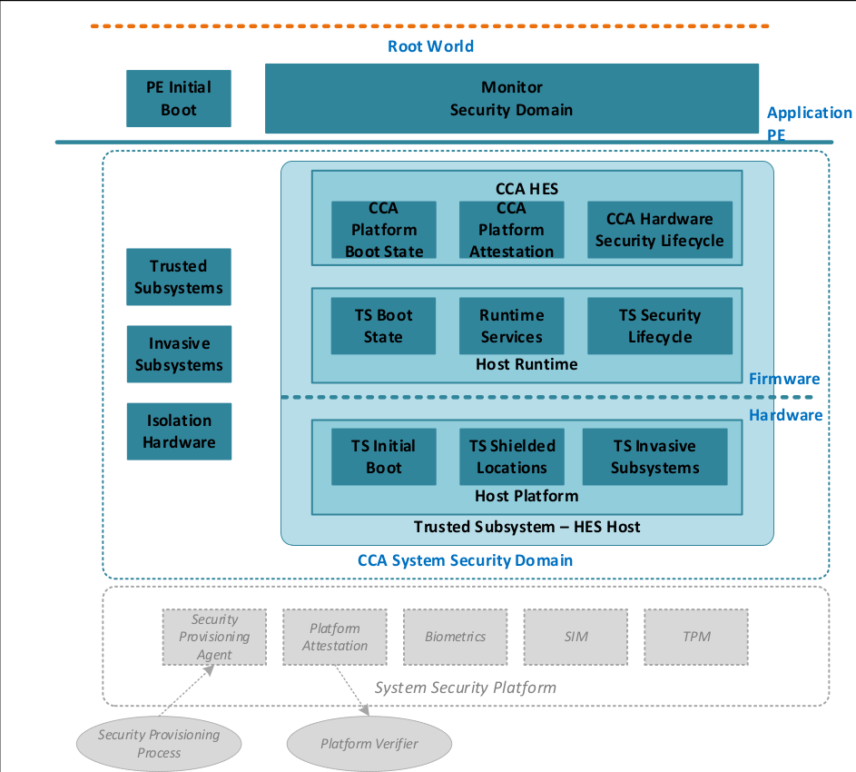
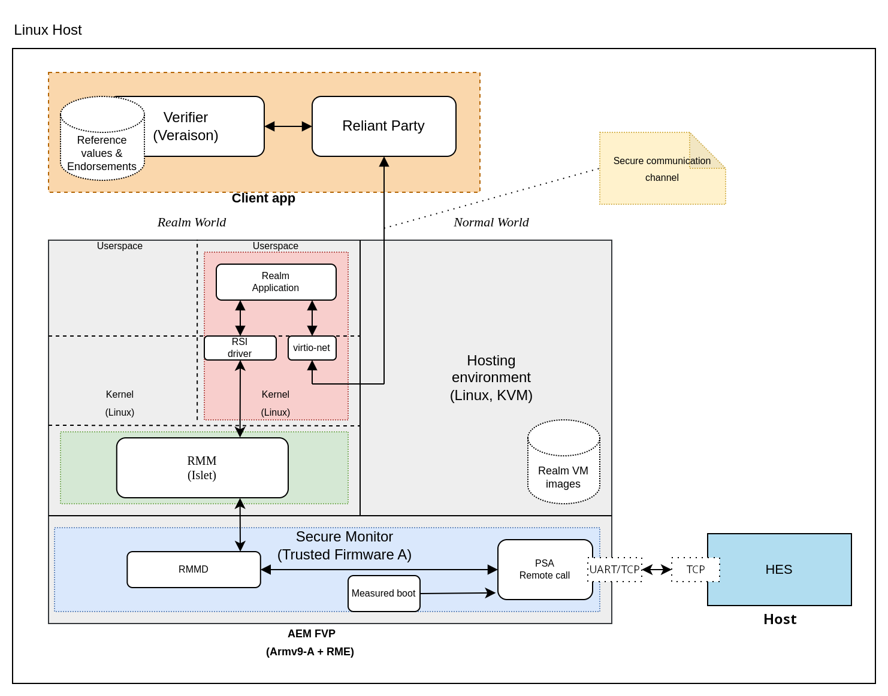
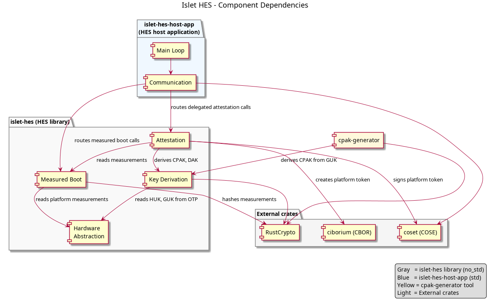
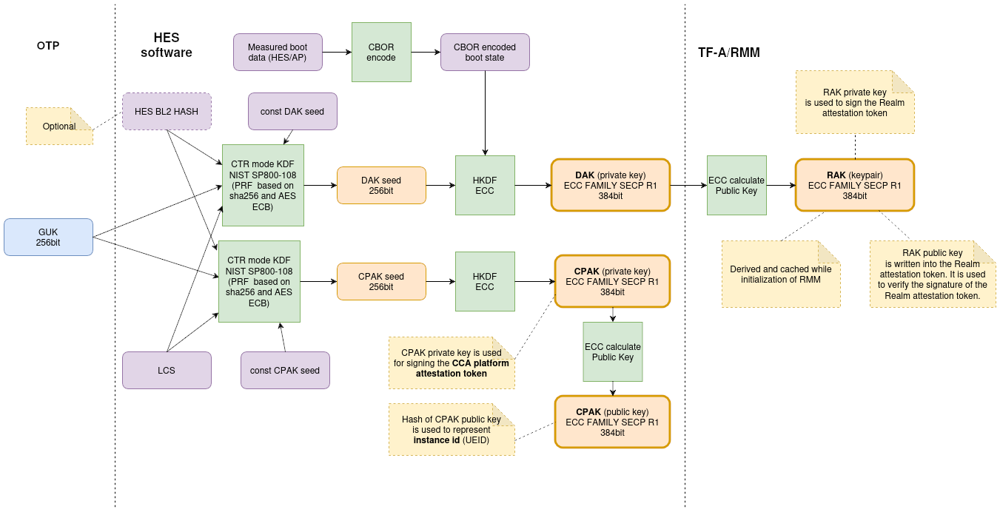
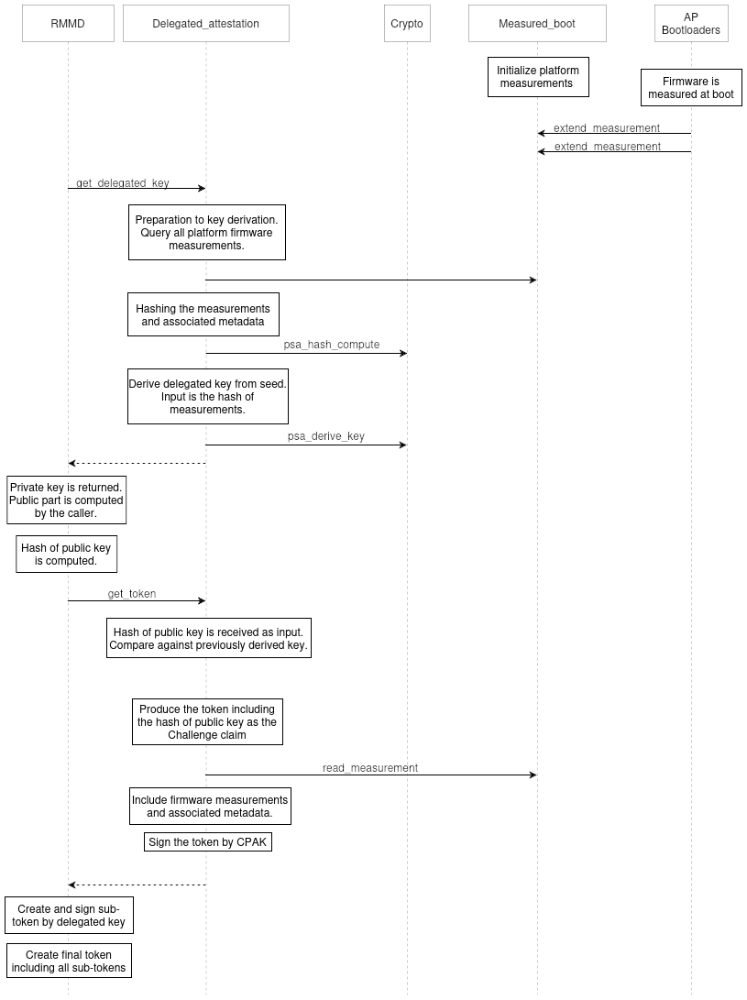
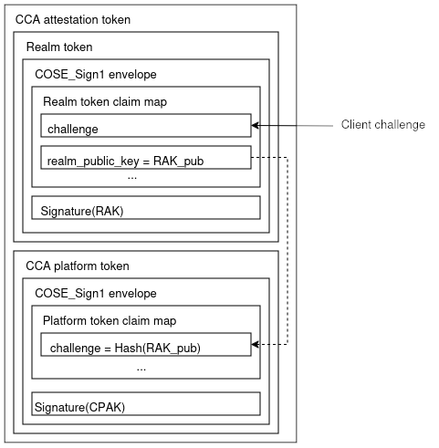
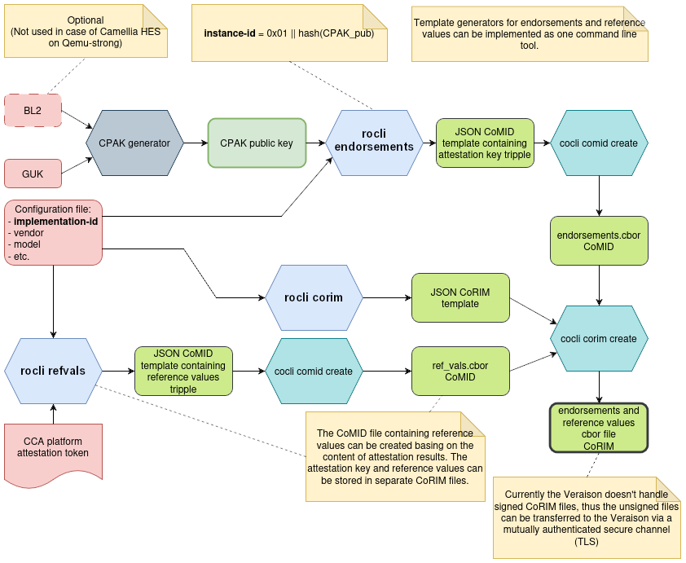
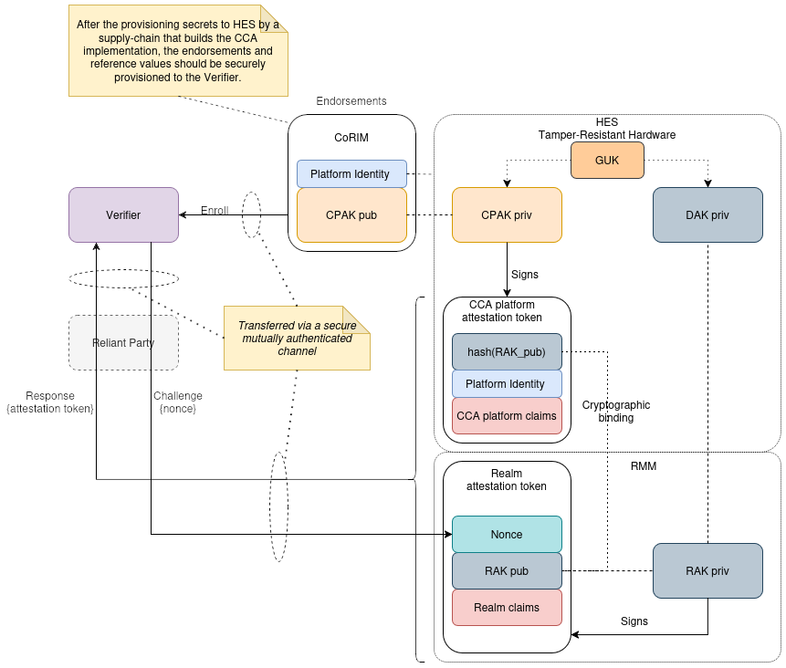

# Hardware Enforced Security

## Introduction

This project provides an implementation of Islet HES that is reification of CCA
Hardware Enforced Security (chapter "Hardware enforced security" of [ARM CCA
Security Model 1.0](https://developer.arm.com/documentation/DEN0096/latest)). It
consists of two main parts:

- **HES library** - a platform-independent (`no_std`) Rust library that
  implements HES functionalities. It is intended to be the basis of a solution
  that can be adapted to real hardware platforms in the future.
- **HES host application** - a hardware HES simulator that runs on the host
  machine (not on dedicated hardware) and is designed to be used together with
  Islet RMM and the Islet CCA stack.

The project is written in Rust - a modern language that has built-in mechanisms
preventing common memory bugs (memory leaks, buffer overflows, etc.). This
greatly minimizes the occurrence of potential vulnerabilities.

The main goals of the Islet HES project are:

- Provide the HES library that is intended to be the basis of a solution that
  can be adapted to real hardware platforms in the future (running e.g. on an
  ARM Cortex-M processor).
- Provide the implementation of the HES application running on the host. The HES
  application is going to provide attestation and measured boot functionality.
- Making the HES implementation a platform for experimentation and development
  of additional functions (not currently defined in CCA specs).

> [!IMPORTANT]
> The current Islet HES works only as a host application and due to that as
> outlined in the section below it cannot satisfy all security requirements of a
> real hardware HES implementation. The short term goal is to have a working
> solution for the purpose of interoperability with Islet RMM. The long term
> goal is to have such implementation running on a real secure hardware/OS while
> reusing many software components (Islet HES library) of the current
> implementation.

## HES technical background

CCA **Hardware Enforced Security** (HES) is a separate from the main Processing
Element component that offers a crucial set of security features for an ARM
CCA-enabled platform (note that PE (Processing Element) or AP (Application
Processor) are used in this document interchangeably). These security features
can be hosted on a dedicated, isolated, trusted subsystem or as a tenant within
a multi-tenant trusted subsystem. The hosting platform and runtime together
constitute what is known as a HES host. The HES host has its own verified boot
process, provides secure non-volatile storage and cryptographic functionality.



*Figure 1: CCA Hardware Enforced Security according to [ARM CCA Security Model 1.0](https://developer.arm.com/documentation/DEN0096/latest)*

Physically HES host can be implemented by using a dedicated MCU (Microcontroller
Unit) which shares no critical resources with the main PE. This greatly reduces
the potential attack surface and ensures that the firmware running on the
application PE cannot affect the internal state of the HES host, such as boot
measurements or boot state. Physical isolation of critical resources, such as
secrets, prevents from leaking sensitive information to PE.

According to [ARM CCA Security Model
1.0](https://developer.arm.com/documentation/DEN0096/latest) CCA HES provides
the following services and interfaces to an application PE:

- CCA platform attestation service
- Interface to capture measurements and associated identity metadata for the
  Monitor, RMM firmware and boot code
- CCA HES can also provide an interface for capturing measurements from other
  trusted subsystems (like ARM's System Control Processor responsible for power
  management)

The critical requirement from security point of view is that these interfaces
should only be accessible to components belonging to CCA System Security
(e.g. trusted subsystems) and Monitor Security Domains (Monitor, PE initial
boot) (chapter 4 **Hardware Enforced Security** of **ARM CCA Security Model**).

CCA HES should also have access to internal HES services providing HES boot
measurements and measurements sent by external systems (e.g. the bootloaders
running on the main PE), cryptographic functionality, secrets and other metadata
(e.g. identification of the platform).

HES host boots from its own non-volatile memory, such as ROM or FLASH, and loads
HES firmware independently, without any PE intervention. HES provides only a
fixed set of functionalities exposed to main PE. HES can run as a tenant within
a multi-tenant trusted subsystem. But also in this case, HES should boot without
intervention of REE side and start to serve its functionality before the main PE
is started. The HES communication channel with the main PE must be accessible
only to Monitor software and boot loaders.

ARM CCA Security Model requires that at minimum, HES should have an immutable
initial boot-loader that servers as a Root of Trust. In the reference
implementation of HES host called
[RSE](https://trustedfirmware-m.readthedocs.io/en/tf-mv2.2.2/platform/arm/rse/index.html),
RSE takes the role of Root of Trust not only for the firmware running on RSE but
also for other PEs on the platform. For example, RSE loads, and authenticates
the BL1 image for the main PE. ARM CCA Security Model, allows the main PE to
have its own initial immutable bootloader (BL1), although in this case the main
PE (AP) should start its own booting process, only after successful booting of
HES. Depending on the architecture, this can be achieved by keeping the main PE
in reset until HES boots and starts serving its functionality. This approach
serves two purposes:

- first, if the HES security is compromised (i.e., if one of the loaded HES
  images fails verification due to tampering), the entire platform will become
  useless
- second, the service for capturing measurements from the PE will be ready to
  serve.

## Requirements

In this section we list the requirements for the Islet HES implementation. For
the host application, obviously none of the CCA Security Model's requirements
related to the underlying hardware platform can be satisfied as the application
serves only as a simulated HES, it's running neither on a real hardware nor even
an emulated one. Nevertheless, the HES implementation can provide interfaces
that allow for future deployments on real hardware platforms.

REQ01: Islet HES should be implemented as a library implementing a subset of HES
functionalities in a platform independent way (Rust no_std). This library can be
used in the future to prepare an implementation running on a dedicated trusted
subsystem, or as a tenant on a multi-tenant trusted subsystem (fulfilling the
R005 of CCA SM).

REQ02: An accompanying application should be written that implements a simulated
HES application running on the host that utilizes HES functionalities from the
library. It should provide a communication channel that makes it possible to
communicate with the PE and provide its services.

REQ03: Islet HES should provide following services to PE:

- delegated attestation service (R0043, R0090, R0129, R0091, R0092, R0093, R0025
  of CCA SM)
- service for capturing measurements (R0010, R0011, R0012, R0013, R0051, R0052,
  R0130, R0073, R0080, R0083, R0084, R0085 of CCA SM)

The external interface for delegated attestation should implement following
functionality:

- fetching the delegated attestation key
- fetching a CCA platform attestation token

The API should conform to the following declarations located in
[include/lib/psa/delegated\_attestation.h](https://github.com/islet-project/3rd-tf-a/tree/main/include/lib/psa/delegated_attestation.h)
of the TF-A source code.

```C
psa_status_t
rse_delegated_attest_get_delegated_key(uint8_t   ecc_curve,
                                       uint32_t  key_bits,
                                       uint8_t  *key_buf,
                                       size_t    key_buf_size,
                                       size_t   *key_size,
                                       uint32_t  hash_algo);

psa_status_t
rse_delegated_attest_get_token(const uint8_t *dak_pub_hash,
                               size_t         dak_pub_hash_size,
                               uint8_t       *token_buf,
                               size_t         token_buf_size,
                               size_t        *token_size);
```

The format of CCA platform token must conform to the description included in the
**Chapter A7 Realm measurement and attestation** of [Realm Management Monitor
specification](https://developer.arm.com/documentation/den0137/1-0rel0).

Since preliminary implementation of measured boot and attestation in TF-A is
intended to work together with the reference HES named
[RSE](https://trustedfirmware-a.readthedocs.io/en/latest/design_documents/rse.html),
the Islet HES should follow the implementations of TF-M/RSE and the additional
[delegated
attestation](https://git.trustedfirmware.org/plugins/gitiles/TF-M/tf-m-extras.git/+/refs/heads/main/partitions/delegated_attestation/)
functionality.

The external interface for measured boot should implement following functionality:

- extending boot measurements

The API should conform to the following function declaration defined in
[include/lib/psa/measured\_boot.h](https://github.com/islet-project/3rd-tf-a/blob/main/include/lib/psa/measured_boot.h)
in the TF-A source code.

```C
psa_status_t
rse_measured_boot_extend_measurement(uint8_t index,
                                     const uint8_t *signer_id,
                                     size_t signer_id_size,
                                     const uint8_t *version,
                                     size_t version_size,
                                     uint32_t measurement_algo,
                                     const uint8_t *sw_type,
                                     size_t sw_type_size,
                                     const uint8_t *measurement_value,
                                     size_t measurement_value_size,
                                     bool lock_measurement);

psa_status_t rse_measured_boot_read_measurement(uint8_t index,
                                                uint8_t *signer_id,
                                                size_t signer_id_size,
                                                size_t *signer_id_len,
                                                uint8_t *version,
                                                size_t version_size,
                                                size_t *version_len,
                                                uint32_t *measurement_algo,
                                                uint8_t *sw_type,
                                                size_t sw_type_size,
                                                size_t *sw_type_len,
                                                uint8_t *measurement_value,
                                                size_t measurement_value_size,
                                                size_t *measurement_value_len,
                                                bool *is_locked);
```

The implementation of measured boot in Islet HES should follow the
implementation of [measured
boot](https://git.trustedfirmware.org/plugins/gitiles/TF-M/tf-m-extras.git/+/refs/heads/main/partitions/measured_boot/)
in RSE (TF-M).

The implementation of attestation and measured boot functionality require
additional functionality such as:

- cryptographic functionality (hashing, signing, encryption, key derivation, TRNG, etc.)
- library for [CBOR](https://www.rfc-editor.org/rfc/rfc7049)
- library for [COSE](https://www.rfc-editor.org/rfc/rfc8152)

REQ04: The serialization/de-serialization and PSA protocol layer for the API
exposed to PE (measured boot and attestation) should be as much as possible
compatible with the existing mechanisms implemented in TF-A and TF-M (RSE). Have
a look at:

- [https://trustedfirmware-a.readthedocs.io/en/latest/design_documents/rse.html](https://trustedfirmware-a.readthedocs.io/en/latest/design_documents/rse.html)
- [https://trustedfirmware-m.readthedocs.io/en/latest/platform/arm/rse/index.html](https://trustedfirmware-m.readthedocs.io/en/latest/platform/arm/rse/index.html)
- [https://github.com/islet-project/3rd-tf-a/blob/main/lib/psa/measured_boot.c](https://github.com/islet-project/3rd-tf-a/blob/main/lib/psa/measured_boot.c)
- [https://github.com/islet-project/3rd-tf-a/blob/main/drivers/measured_boot/rse/rse_measured_boot.c](https://github.com/islet-project/3rd-tf-a/blob/main/drivers/measured_boot/rse/rse_measured_boot.c)
- [https://github.com/islet-project/3rd-tf-a/blob/main/lib/psa/delegated_attestation.c](https://github.com/islet-project/3rd-tf-a/blob/main/lib/psa/delegated_attestation.c)

REQ05: The Islet HES should provide:

- measured boot for HES SW components that are not immutable (R0010, R0011,
  R0012, R0013, R0159, R0054, R0068, R0069, R0070 of CCA SM)
- a simulated interface for communication between the main PE and HES

## Architecture

This chapter will describe the architecture of Islet HES. To put Islet HES in
context, we start from the brief description of the whole system that as it's
being used in the attestation demo. Then, we describe the Islet HES itself,
its building blocks, functionality and other details.

### CCA Remote Attestation High Level Design for the demo

The information regarding running the demo is available in:
[`examples/veraison`](https://github.com/islet-project/islet/tree/main/examples/veraison).



*Figure 2: High level diagram showing the SW/FW stack used for development and demoing Arm CCA functionality*

ARM CCA Security Model recommends to have HES in a CCA enabled platform. The
platform should also support Realm Management Extension (RME) to be fully
compatible with the ARM CCA requirements. During the research phase, there was
no platform (HW or emulated) that is equipped with both HES and a main PE that
supports RME. This led to the design of a simple simulated HES that would
provided necessary interfaces to the PE. Another question that we had to deal
with was how to implement the communication channel between these two entities.

From this we decided that:

- The main PE that supports RME will be emulated either on AEM FVP or a RME
  enabled QEMU.
- The Islet HES will run directly on the host.
- The UART device from PE/TF-A side will be used to create a communication
  channel with HES. This UART is then mapped as a TCP connection by either FVP
  or QEMU. HES host application uses TCP directly.

The above diagram represents the system for the attestation demo. The ARM
FVP/QEMU hosts all software components that supports ARM CCA. The main clients
of HES are boot loaders of TF-A and RMMD. During the boot process of the main
PE, the boot loaders send the measurements to the HES via PSA remote call
API. Originally, TF-A uses a mailbox interface for transferring messages between
PE and RSE. For our purposes, we replaced the MHU (Message Handling Unit) driver
with UART, at the same time keeping the binary compatibility of the messages.

Another functionality that HES is going to provide is the delegated
attestation. During the initialization of RMM, RMM requests the Delegated
Attestation Key from the HES that is used to sign the Realm attestation
token. The key is retrieved only once an cached by RMM. The CCA platform
attestation token is requested from HES only once during the platform startup
and then cached. Upon the Reliant Party request (it is a remote party client)
RMM prepares a realm attestation token. This token altogether with the CCA
platform attestation token is concatenated and sent back to the requester. The
Reliant Party then relays the attestation token to the Verifier which checks its
signature and verifies measurements against the reference values stored in the
Verifier's database. The results of verification are sent back to the Reliant
Party that according to some policy may decide if it can trust the Realm and the
whole platform.

### Islet HES architecture

The user space HES application is built-up from the following components:

- Attestation - the main responsibility of this component is preparation of the
  CCA platform attestation token. The interfaces exposed to external PEs include
  fetching the attestation token and fetching the delegated attestation
  key. This component utilizes information gathered by the measured boot
  component and functions provided by auxiliary modules like CBOR and COSE
  (creating the binary representation of the CCA platform attestation token,
  creating a digital signature) and Key derivation.The source code is available in
  - [`hes/islet-hes/src/attestation/mod.rs`](https://github.com/islet-project/islet/tree/main/hes/islet-hes/src/attestation/mod.rs).
- Measured boot - the main function of this component is gathering measurements
  from the external PEs. During initialization of the HES application, this
  component also fetches local measurements from the platform HES host measured
  boot component. The attestation component makes use of measurements gathered
  by this component to build the CCA platform attestation token. The measured
  boot component uses also the hash functions provided by the Crypto component.
  The source code is available in the following files:
  - [`hes/islet-hes/src/measured_boot/measurement.rs`](https://github.com/islet-project/islet/blob/main/hes/islet-hes/src/measured_boot/measurement.rs).
  - [`hes/islet-hes/src/measured_boot/manager.rs`](https://github.com/islet-project/islet/blob/main/hes/islet-hes/src/measured_boot/manager.rs),
- Hardware abstraction layer - this component is an interface for a simulated
  hardware that makes it immediately clear what data should be obtained from the
  underlying secure hardware itself. The current implementation stubs, hardcodes
  or reads the values from files, but in case of a real hardware implementation
  all those values/functionalities should be obtained/implemented in the secure
  hardware itself (as per CCA HES Security Model). The source code is available
  in:
  - [`hes/islet-hes/src/hw/mod.rs`](https://github.com/islet-project/islet/blob/main/hes/islet-hes/src/hw/mod.rs).
- Communication - the main functionality of this component is handling the
  communication protocol and serialization/de-serialization of messages
  exchanged between the main PE and the HES. This includes de-serialization of
  received binary messages, routing particular calls to attestation and measured
  boot components, serialization of responses that are to be sent back to the
  main PE/TF-A via the UART device. The source code is available in the
  following files:
  - [`hes/islet-hes-host-app/src/comms/psa_serde.rs`](https://github.com/islet-project/islet/blob/main/hes/islet-hes-host-app/src/comms/psa_serde.rs),
  - [`hes/islet-hes-host-app/src/comms/mod.rs`](https://github.com/islet-project/islet/blob/main/hes/islet-hes-host-app/src/comms/mod.rs).
- CPAK generator - a standalone tool for deriving the CCA Platform Attestation
  Key (CPAK) public key from the provisioned GUK (and optionally the BL2 boot
  loader image hash). It follows the same key derivation scheme as the HES
  library's Key derivation component. The derived CPAK public key is used during
  the preparation of endorsements and reference values that are provisioned to
  the Veraison verification service, so that the Verifier can verify the
  signature of CCA platform attestation tokens. The source code is available in:
  - [`hes/cpak-generator/src/main.rs`](https://github.com/islet-project/islet/blob/main/hes/cpak-generator/src/main.rs).
- Auxiliary components: CBOR, COSE, Key derivation, Crypto - the attestation and
  measured boot component rely on these components. The Key derivation component
  interacts with the Crypto component and reads seed data from the OTP (HUK, GUK
  keys), Lifecycle manager, and Measured boot components.

Apart from the implemented functionalities, some external components and
interfaces for platform specific are utilized.

The required external components are:

- [ciborium](https://crates.io/crates/ciborium) - Rust crate library compatible
  with CBOR format for platform token creation,
- [coset](https://crates.io/crates/coset) - Rust crate library compatible with
  COSE\_sign1 for platform token signing and creation, which utilizes the
  ciborium crate for CBOR parsing and allows usage of custom crypto API for
  token signing,
- [RustCrypto](https://github.com/RustCrypto) - set of crates implementing the
  required cryptographic functionalities (key derivation, signatures etc.),

Supported (hardware provisioned on a real hardware) keys are:

- HUK - as a 256 bit symmetric key,
- GUK - as a 256 bit symmetric key,
- CPAK - (optional, can be derived manually) as an ECC\_FAMILY\_SECP\_R1 asymmetric key,

### Component dependencies



*Figure 3: HES component dependency diagram*

### Directory structure

This section describes the content of
[https://github.com/islet-project/islet/tree/main/hes](https://github.com/islet-project/islet/tree/main/hes)
directory.

- [`cpak-generator`](https://github.com/islet-project/islet/blob/main/hes/cpak-generator):
  A tool for deriving the CPAK public key from GUK (and optionally the BL2 hash).
  It is used during the preparation of endorsements and reference values for the
  Veraison verification service.
- [`islet-hes`](https://github.com/islet-project/islet/blob/main/hes/islet-hes):
  The HES library crate implementing the core HES functionalities (attestation,
  measured boot, hardware abstraction layer) in a platform-independent way.
  - [`islet-hes/src/attestation`](https://github.com/islet-project/islet/blob/main/hes/islet-hes/src/attestation):
    Delegated attestation component - preparation of CCA platform attestation
    tokens and fetching of the delegated attestation key.
  - [`islet-hes/src/hw`](https://github.com/islet-project/islet/blob/main/hes/islet-hes/src/hw):
    Hardware abstraction layer - interface for simulated hardware data. The
    current implementation stubs, hardcodes or reads the values from files.
  - [`islet-hes/src/measured_boot`](https://github.com/islet-project/islet/blob/main/hes/islet-hes/src/measured_boot):
    Measured boot component - gathering and managing boot measurements from
    external PEs and from the HES host itself.
- [`islet-hes-host-app`](https://github.com/islet-project/islet/blob/main/hes/islet-hes-host-app):
  The HES host application that simulates a hardware HES on the host machine.
  It includes the communication component (PSA message serialization and the
  UART/TCP channel) and the main application loop.
- [`key-derivation`](https://github.com/islet-project/islet/blob/main/hes/key-derivation):
  Key derivation library - implements the key derivation schemes (CPAK, DAK
  derivation from GUK) following the same scheme as TF-M's RSE.

### Initialization

During the initialization of the Islet HES the following actions are performed:

- derivation of 256bit CPAK_seed from GUK (and optionally BL2 hash) using counter-mode KDF,
- derivation of asymmetric CPAK from CPAK_seed
- derivation of 256bit DAK seed from GUK
- initialization of dummy measurements for hardware/platform components
- initialization of the communication component

After the initialization of all HES components, the application goes into the
idle mode and waits in the loop for the incoming requests from the communication
channel.

### Cryptographic Keys

Minimum CCA hardware provisioned keys are ([CCA Security Model 1.0 Ch
5.1](https://developer.arm.com/documentation/DEN0096/latest)):

| Parameter | Description                                                                                                                                                                                   | Secret |
|-----------|-----------------------------------------------------------------------------------------------------------------------------------------------------------------------------------------------|--------|
| HUK       | Hardware unique symmetric key. It represents a randomly unique seed for each manufactured instance of a CCA enabled system.                                                                   | Yes    |
| GUK       | Group unique symmetric key. It represents a randomly unique seed that may be shared with some group of manufactured CCA enabled systems with the same immutable hardware security properties. | Yes    |

**HUK** is randomly generated at manufacture and can only be accessed by CCA HES
at any point in the security lifecycle of the system.

**GUK** is at least randomly unique for some group of manufactured instances of
a CCA enabled system and can only be accessed by CCA HES, other than temporarily
at security provisioning (it can be stored temporarily outside of system for the
purpose of manufacture provisioning, but must not be collected or stored
persistently outside of the system).

The most important derived parameters of CCA ([CCA Security Model 1.0 Ch
5.2](https://developer.arm.com/documentation/DEN0096/latest)):

| Parameter                                                 | Description                                                                                                                     | Private              | Ownership                        | Source                                                                                                        |
|-----------------------------------------------------------|---------------------------------------------------------------------------------------------------------------------------------|----------------------|----------------------------------|---------------------------------------------------------------------------------------------------------------|
| Derivation root keys for Monitor security domain          | Virtual HUK/GUK, derived uniquely for Monitor security domain at boot.                                                          | Yes                  | Monitor security domain          | PE initial boot, or CCA HES                                                                                   |
| Derivation root keys for Realm Management security domain | Vritual HUK/GUK, derived uniquely for Realm Management security domain at boot.                                                 | Yes                  | Realm Management security domain | Monitor security domain                                                                                       |
| CCA platform attestation key (CPAK)                       | Asymmetric attestation key for the CCA platform. Identifies the immutable security properties of the CCA system security domain | Yes, private portion | CCA HES                          | Typcally derived from GUK, or equivalent.                                                                     |
| CPAK ID                                                   | Pubic identifier of CPAK                                                                                                        | No                   | CCA HES                          | Hash of public part of CPAK.Uniquely identifies the immutable hardware security properties of a CCA platform. |

The following tables outline general recommendations for parameters sizes and
algorithms in CCA implementation ([CCA Security Model 1.0 Ch
12.3.](https://developer.arm.com/documentation/DEN0096/latest)):

| Parameter type                            | Sizes                         | Information                                                                                                             |
|-------------------------------------------|-------------------------------|-------------------------------------------------------------------------------------------------------------------------|
| Public identifier                         | 512 bits                      | Typically a hash of a public key or a certificate.Arm does not recommend using truncated hashes for public identifiers. |
| Counter values used as unique identifiers | 64 bits                       |                                                                                                                         |
| Seeds used for symmetric key derivations  | 256 bits                      |                                                                                                                         |
| Symmetric keys                            | 256 bits                      | AES-256                                                                                                                 |
| Asymmetric keys                           | RSA: 3072 bits, ECC: 384 bits | RSA 3072, ECC Curve-P384                                                                                                |

| Operation               | Algorithm                                                             | Information                                       |
|-------------------------|-----------------------------------------------------------------------|---------------------------------------------------|
| General encryption      | AES-256                                                               |                                                   |
| Hash function           | SHA-512                                                               | NIST SP 800-107                                   |
| Signing - RSA operation | RSA-PKCS#1 v2.2, RFC 8017, FIPS PUB 186-4                             | RSASSA-PSS 3072, EMS-PSS, SHA-512                 |
| Signing - ECC option    | ECDSA, RFC 6979, FIPS PUB 186-4                                       | Curve P-384, SHA-512                              |
| Signing - Symmetric     | HMAC-SHA512, RFC 2014, NIST SP 800-107                                | 512 bits, Arm does not recommend truncating HMAC. |
| Key derivations         | NIST SP 800-108, Counter mode, HMAC-SHA512, RFC 2014, NIST SP 800-107 |                                                   |

The Islet HES application utilizes the same scheme of key derivation as
implemented in TF-M's RSE. The RSE-based implementation derives the seeds and
keys based on the following graph:



*Figure 4: The key derivation process*

### Measured boot and attestation

Measured Boot component provides interfaces to extend and read measurements
(hash values and metadata) during various stages of a power cycle. The
measurements are extended by the boot loaders running on AP (via the external
interface - UART in our case). They are read by the delegated attestation
component and used to generate the CCA platform attestation token. All of these
measurements are fetched by Measured Boot component during its initialization.

Each software component claim comprises of the following measurements which are
extended and read by Measured Boot component.

- Measurement type: It represents the role of the software component.
- Measurement value: It represents a hash of the invariant software component in
  memory at start-up time. The value must be a cryptographic hash of 256 bits or
  stronger.
- Version: It represents the issued software version.
- Signer ID: It represents the hash of a signing authority public key.
- Measurement description: It represents the way in which the measurement value
  of the software component is computed.

These measurements are used as software component claims of the platform token.

The ARM CCA based implementation utilizes a model where the responsibility of
creating the overall attestation token is split between different parties (HES
and RMM). The overall token is a composition of sub-tokens, where each sub-token
is produced by an individual entity within the system. Each sub-token is signed
with a different key, which is owned by the sub-token producer. The signing keys
are derived in a chain. Each key is derived by the producer of the previous (in
the chain) attestation token. The sub-tokens must be cryptographically bound to
each other, to make the key chain back traceable to the CPAK, which is used to
sign the platform attestation token. The cryptographic binding is achieved by
including the hash of the public key in the challenge claim of the predecessor
attestation token.

The following diagram shows the simplified flow of delegated key derivation and the CCA platform token creation:



*Figure 5: The sequence diagram of the delegated attestation process*

A CCA attestation token according to [RMM specification
A7.2.1](https://developer.arm.com/documentation/den0137/1-0rel0) is a collection
of claims about the state of a Realm and of the CCA platform on which the Realm
is running. A CCA attestation token consists of two parts:

- Realm token: contains attributes of the Realm, including:
  - Realm Initial Measurement
  - Realm Extensible Measurements
- CCA platform token: contains attributes of the CCA platform on which the Realm is running, including:
  - CCA platform identity
  - CCA platform lifecycle state
  - CCA platform software component measurements

The CCA platform token contains structured data in CBOR, wrapped with a
COSE_Sign1 envelope according to COSE standard signed by the CPAK.

The CCA attestation token is defined as follows (using [Concise Data Definition
Language](https://datatracker.ietf.org/doc/rfc8610/)):

```
cca-token = #6.399(cca-token-collection) ; CMW Collection
                                         ; (draft-ietf-rats-msg-wrap)
cca-platform-token = bstr .cbor COSE_Sign1_Tagged
cca-realm-delegated-token = bstr .cbor COSE_Sign1_Tagged
cca-token-collection = {
    44234 => cca-platform-token          ; 44234 = 0xACCA
    44241 => cca-realm-delegated-token
}

; EAT standard definitions
COSE_Sign1_Tagged = #6.18(COSE_Sign1)

; Deliberately shortcut these definitions until EAT is finalised and able to
; pull in the full set of definitions
COSE_Sign1 = "COSE-Sign1 placeholder"
```

The composition of the CCA attestation token is summarized in the following figure:



*Figure 6: The structure of the Arm CCA attestation token*

The details of claims carried by the CCA platform token are described in [RMM
specification
A7.2.3.2](https://developer.arm.com/documentation/den0137/1-0rel0). Here is an
excerpt.

The CCA platform token claim map is defined as follows (represented in CDDL):


```
cca-platform-claims = (cca-platform-claim-map)

cca-platform-claim-map = {
    cca-platform-profile
	cca-platform-challenge
	cca-platform-implementation-id
	cca-platform-instance-id
	cca-platform-config
	cca-platform-lifecycle
	cca-platform-sw-components
	? cca-platform-verification-service
	cca-platform-hash-algo-id
}

cca-platform-profile-label = 265 ; EAT profile
cca-platform-profile-type = "tag:arm.com,2023:cca_platform#1.0.0"
cca-platform-profile = (
	cca-platform-profile-label => cca-platform-profile-type
)

cca-hash-type = bytes .size 32 / bytes .size 48 / bytes .size 64
cca-platform-challenge-label = 10
cca-platform-challenge = (
	cca-platform-challenge-label => cca-hash-type
)

cca-platform-implementation-id-label = 2396 ; PSA implementation ID
cca-platform-implementation-id-type = bytes .size 32
cca-platform-implementation-id = (
	cca-platform-implementation-id-label => cca-platform-implementation-id-type
)

cca-platform-instance-id-label = 256 ; EAT ueid
; TODO: require that the first byte of cca-platform-instance-id-type is 0x01
; EAT UEIDs need to be 7 - 33 bytes
cca-platform-instance-id-type = bytes .size 33
cca-platform-instance-id = (
	cca-platform-instance-id-label => cca-platform-instance-id-type
)

cca-platform-config-label = 2401 ; PSA platform range
                                 ; TBD: add to IANA registration
cca-platform-config-type = bytes
cca-platform-config = (
	cca-platform-config-label => cca-platform-config-type
)

cca-platform-lifecycle-label = 2395 ; PSA lifecycle
cca-platform-lifecycle-unknown-type = 0x0000..0x00ff
cca-platform-lifecycle-assembly-and-test-type = 0x1000..0x10ff
cca-platform-lifecycle-cca-platform-rot-provisioning-type = 0x2000..0x20ff
cca-platform-lifecycle-secured-type = 0x3000..0x30ff
cca-platform-lifecycle-non-cca-platform-rot-debug-type = 0x4000..0x40ff
cca-platform-lifecycle-recoverable-cca-platform-rot-debug-type = 0x5000..0x50ff
cca-platform-lifecycle-decommissioned-type = 0x6000..0x60ff
cca-platform-lifecycle-type =
	cca-platform-lifecycle-unknown-type /
	cca-platform-lifecycle-assembly-and-test-type /
	cca-platform-lifecycle-cca-platform-rot-provisioning-type /
	cca-platform-lifecycle-secured-type /
	cca-platform-lifecycle-non-cca-platform-rot-debug-type /
	cca-platform-lifecycle-recoverable-cca-platform-rot-debug-type /
	cca-platform-lifecycle-decommissioned-type
cca-platform-lifecycle = (
	cca-platform-lifecycle-label => cca-platform-lifecycle-type
)

cca-platform-sw-components-label = 2399 ; PSA software components
cca-platform-sw-component = {
  ? 1 => text,          ; component type
    2 => cca-hash-type, ; measurement value
  ? 4 => text,          ; version
    5 => cca-hash-type, ; signer id
  ? 6 => text,          ; hash algorithm identifier
}
cca-platform-sw-components = (
	cca-platform-sw-components-label => [ + cca-platform-sw-component ]
)

cca-platform-verification-service-label = 2400 ; PSA verification service
cca-platform-verification-service-type = text
cca-platform-verification-service = (
	cca-platform-verification-service-label =>
		cca-platform-verification-service-type
)

cca-platform-hash-algo-id-label = 2402 ; PSA platform range
                                       ; TBD: add to IANA registration
cca-platform-hash-algo-id = (
	cca-platform-hash-algo-id-label => text
)

```

The CCA platform profile claim identifies the EAT profile to which the CCA
platform token conforms. Note that because the platform token is expected to be
issued when bound to a Realm token, the profile document should include a
description of the Realm claims. It s identified using the EAT profile label
(265).

The CCA platform challenge claim contains a hash of the public key used to sign
the Realm token. It is identified using the EAT nonce label (10).

The CCA platform Implementation ID claim uniquely identifies the implementation
of the CCA platform. The value of the CCA platform Implementation ID claim can
be used by a verification service to locate the details of the CCA platform
implementation from an endorser or manufacturer. Such details are used by a
verification service to determine the security properties or certification
status of the CCA platform implementation. The semantics of the CCA platform
Implementation ID value are defined by the manufacturer or a particular
certification scheme. For example, the ID could take the form of a product
serial number, database ID, or other appropriate identifier.

The CCA platform Instance ID claim represents the unique identifier of the CPAK
for the CCA platform. The CCA platform Instance ID claim is identified using the
EAT UEID label (256). The first byte of its value must be 0x01
(https://datatracker.ietf.org/doc/draft-ietf-rats-eat/ ). RSE implementation
defines it as **instance\_id= 0x01 || hash(CPAK\_pub**.

The CCA platform config claim describes the set of chosen implementation options
of the CCA platform. As an example, these may include a description of the level
of physical memory protection which is provided. The CCA platform config claim
is expected to contain the System Properties field which is present in the Root
Non-volatile Storage (RNVS) public parameters.

The CCA platform lifecycle claim identifies the lifecycle state of the CCA
platform. The value of the CCA platform lifecycle claim is an integer which is
divided as follows:

- value[15:8]: CCA platform lifecycle state
- value[7:0]: IMPLEMENTATION DEFINED

The CCA platform software components claim is a list of software components
which can affect the behavior of the CCA platform. It is expected that an
implementation will describe the expected software component values within the
profile. The CCA platform software component type is a string which represents
the role of the software component. It s intended for use as a hint to help the
relying party understand how to evaluate the CCA platform software component
measurement value. The CCA platform software component measurement value
represents a hash of the state of the software component in memory at the time
it was initialized. The CCA platform software component version is a text string
whose meaning is defined by the software component vendor. The CCA platform
software component signer ID is the hash of a signing authority public key for
the software component. It can be used by a verifier to ensure that the software
component was signed by an expected trusted source. The CCA platform software
hash algorithm ID identifies the way in which the hash algorithm used to measure
the CCA platform software component. The CCA platform verification service claim
is a hint which can be used by a relying party to locate a verifier for the
token. Its value is a text string which can be used to locate the service or a
URL specifying the address of the service. The CCA platform hash algorithm ID
claim identifies the algorithm used to calculate the extended measurements in
the CCA platform token.

All of these values are stubbed for the demo purpose. On a real HW platform most
of these values should be provided by the underlying platform. For example, a
CCA platform implementation ID may represent a unique identifier of the
implementation of immutable RoT, this value can be stored in ROM altogether with
the immutable boot loader image.

## Security provisioning

The process of provisioning secrets and other data (e.g. identity) is platform
specific. Provisioned data may take the form of a signed and encrypted bundle
transferred to a platform via some dedicated interface, or injected directly to
RAM via JTAG interface (TF-M RSE case). Apart from platform specific keys (used
for verified boot etc.), the CCA requires to have provisioned two dedicated
keys: GUK and HUK (see Cryptographic keys).

In case of Islet HES, these secrets are hard coded in the
[files](https://github.com/islet-project/islet/tree/main/hes/res) read by the
source code or in the [source
code](https://github.com/islet-project/islet/tree/main/hes/islet-hes-host-app/src/main.rs#L369)
itself. Nevertheless, the derived CPAK public key and the platform identity
metadata should be delivered to the Verifier to be able to verify the signature
of the CCA platform attestation token.

Here is a minimum list of provisioned secrets that are needed by the HES
application (doesn't include secrets that are required by the underlying
platform):

- **HUK** (for more information refer to the Cryptographic Keys chapter) -
  currently not used in key derivation, but it can be used in future use cases
  (e.g. derivation of sealing keys)
- **GUK** (for more information refer to the Cryptographic Keys chapter)

### CPAK_pub derivation

During the security provisioning phase, a vendor/manufacturer should provision
GUK and HUK keys to the HES. The GUK key is used in the CPAK derivation
process. The private part of CPAK is used to sign the CCA platform attestation
token. To verify the authenticity of the token, a verifier should have access to
the public part of CPAK.

In our case, the CPAK\_pub is derived from GUK (and optionally the image of the
2nd level boot loader if present) using a dedicated tool. This tool is following
the same derivation scheme as described in the Cryptographic Keys chapter. It's
available in
[`hes/cpak-generator/src/main.rs`](https://github.com/islet-project/islet/blob/main/hes/cpak-generator/src/main.rs).

The `cpak_generator` tool is being used during the preparation of endorsements
and reference values. The derived CPAK\_pub keys are used to verify the
signature of generated CCA platform tokens.

### Endorsements and reference values provisioning

In this section we describe the process and the tools used for preparation of
endorsements and reference values (https://datatracker.ietf.org/doc/rfc9334/)
that have to be provisioned to a verification service. In our case the
[Veraison](https://github.com/veraison) project is acting as a verification
service. The Veraison project is officially referred by ARM in their
documentation and is a part of
[IETF/RATS](https://datatracker.ietf.org/wg/rats/about/) project. The intention
of Veraison's developers is not only to support ARM CCA but also other
attestation technologies.

The described process of provisioning and the tools developed for the Islet HES
are being used in the attestation demo. For more information about the demo,
Veraison and processes detailed further in this section please refer to the
following links:

- [https://github.com/islet-project/islet/tree/main/examples/veraison](https://github.com/islet-project/islet/tree/main/examples/veraison)
- [https://github.com/islet-project/islet/blob/main/examples/veraison/RUN.md](https://github.com/islet-project/islet/blob/main/examples/veraison/RUN.md)
- [https://github.com/islet-project/islet/blob/main/examples/veraison/provisioning/run.sh](https://github.com/islet-project/islet/blob/main/examples/veraison/provisioning/run.sh)



*Figure 7: The process of generating endorsements and reference values intended to be provisioned to the Veraison verification service*

The above diagram show the process of creating
[CoRIM](https://www.ietf.org/archive/id/draft-birkholz-rats-corim-03.html#name-comid)
(Concise Reference Integrity Manifest) documents containing the endorsements and
reference values. CoRIM documents can bundle multiple
[CoMID](https://datatracker.ietf.org/doc/draft-birkholz-rats-corim/) (Concise
Module Identifiers) and
[CoSWID](https://datatracker.ietf.org/doc/draft-ietf-sacm-coswid/) (Concise
Software Identification Tags) documents. CoMID format describes the hardware and
firmware modules, whereas CoSWID format describes the software components. The
CoMID, CoRIM and CoSWID files utilize the CBOR encoding. In case of ARM CCA
scheme implemented in Veraison, only CoMID documents are used to carry
reference-triples and attest-key-triples (For more info please refer to
[https://github.com/veraison/docs/tree/main/demo/cca](https://github.com/veraison/docs/tree/main/demo/cca)
and
[https://github.com/veraison/services/tree/main/scheme/arm-cca](https://github.com/veraison/services/tree/main/scheme/arm-cca)).

The `rocli` tool mentioned on the diagram is a custom developed helper that is
available
[in the `rocli` repository](https://github.com/islet-project/rocli).

The generated CoRIM documents are intended to be provisioned to the [Veraison
provisioning
service](https://github.com/veraison/services/tree/main/provisioning) by using
the cocli submit command. See more here:

- [https://github.com/veraison/docs/blob/main/api/endorsement-provisioning/README.md](https://github.com/veraison/docs/blob/main/api/endorsement-provisioning/README.md)
- [https://github.com/veraison/docs/blob/main/demo/cca/manual-end-to-end.md](https://github.com/veraison/docs/blob/main/demo/cca/manual-end-to-end.md)



*Figure 8: Details regarding relation between the keys used to sign and verify the CCA Platform and Realm tokens*

The above diagram helps to better understand what keys are used and how they are
related to each other in the context of the CCA remote attestation.

The HES is in the possession of the GUK that is kept in secret. GUK is used in
derivations of CPAK and DAK. The CPAK priv, which is also held securely in HES,
is used to sign the CCA platform attestation token.

The public part of CPAK altogether with the identification data (instance-id,
implementation-id) should be securely provisioned to the Verifier via mutually
authenticated secure channel during the manufacturing process at the
manufacturer's premises.

The ARM CCA enabled system generates an attestation token being a concatenation
of the CCA platform attestation token and the Realm attestation token. The Realm
attestation token is signed using the private part of RAK, the public part of
RAK is included in the Realm attestation token.

To protect from reply attacks, the nonce sent by the Verifier is included into
the Realm attestation token. To cryptographically bind the Realm attestation
token to the CCA platform attestation token, the hash of public part of RAK is
included in the CCA platform attestation token.

The Verifier can check the authenticity of the CCA platform attestation token by
using previously provisioned CPAK pub. The authenticity of the Realm attestation
token can be checked by verifying the signature against the RAK pub.

## Communication channel

On the real hardware the communication channel between main PE and HES is
utilizing a hardware mailbox channel like
[MHU](https://github.com/islet-project/3rd-tf-a/blob/main/drivers/arm/mhu/mhu_v2_x.c).

In our case the PE running on FVP/QEMU utilizes a simple custom developed [UART
channel](https://github.com/islet-project/3rd-tf-a/blob/hes/drivers/arm/rse/rse_comms_serial.c)
that is placed instead of the MHU in the TF-A. The measured boot and delegated
attestation have been restored for the FVP and QEMU platforms to utilize the
aforementioned channel. The modified TF-A sources are available [on the `hes`
branch of `tf-a` repository](https://github.com/islet-project/3rd-tf-a/tree/hes).

The UART is mapped onto TCP device on the host by FVP or QEMU in their
respective configuration options. Islet HES host application uses TCP to
establish connection with the FVP or QEMU and use this channel to exchange
messages.

> [!IMPORTANT]
> The current UART/TCP channel implementation between PE and HES is NOT secure
> and is only used for the purpose of development and simulating the HES without
> a real hardware. In case of implementing HES on an actual hardware a secure
> hardware level channel needs to be used (as per CCA HES Security
> Model). E.g. like the aforementioned MHU mailbox on ARM platforms. The target
> hardware/OS used is out of scope of this document.

The communication mechanism does follow the RSE protocol and serialization (as
described in REQ04). This way the HES communication is compatible with the ARM's
TF-A/TF-M RSE. This approach reduces the amount of changes in the TF-A source
code while adding the support for UART device. It also enable easier porting of
the Islet HES to ARM platforms that currently utilize RSE in the role of HES.

The analysis of the TF-A and TF-M RSE source code tells us that the HES works
passively. HES waits for a message, handles it and sends a response back to the
main PE. The protocol works synchronously. There is no handling of multiple
messages at the same time. HES is blocked until it handles a message and sends
the results back to the Secure Monitor.

TF-A also sends messages synchronously. After sending a request (e.g. extending
measurements) it waits for the response message.

The main requirement is that the high level API should follow the `psa_call()`
format
([drivers/arm/rse/rse\_comms.c](https://github.com/islet-project/3rd-tf-a/blob/main/drivers/arm/rse/rse_comms.c)),
and the low level format of the exchanged messages should be compatible with the
description of "embed" protocol described in the RSE documentation
https://trustedfirmware-m.readthedocs.io/en/tf-mv2.2.2/platform/arm/rse/rse_comms.html

Here is an excerpt from the RSE documentation that describe the format of
messages exchanged between the HES and the Secure Monitor. Note that the
structures are adjusted to consider only the embed protocol.

The requests messages encoded by the Secure Monitor should be implemented as the
following structure (note that the endianness of the binary representations of
the messages should be the same on both sides):

```C
__PACKED_STRUCT serialized_psa_msg_t {
    struct serialized_rse_comms_header_t header;
    struct rse_embed_msg_t embed;
};
```

Replies from the Islet HES should take form:

```C
__PACKED_STRUCT serialized_psa_reply_t {
    struct serialized_rse_comms_header_t header;
    struct rse_embed_reply_t embed;
};
```

All messages carry the following header:

```C
__PACKED_STRUCT serialized_rse_comms_header_t {
    uint8_t protocol_ver;
    uint8_t seq_num;
    uint16_t client_id;
};
```

The `protocol_ver` should be set to 0. This means that the "embed" protocol is used.

The embed protocol embeds the `psa_call` iovecs into the messages directly sent over the channel (UART, socket).

The embed message has the following format:

```C
__PACKED_STRUCT rse_embed_msg_t {
    psa_handle_t handle;
    uint32_t ctrl_param;
    uint16_t io_size[PSA_MAX_IOVEC];
    uint8_t payload[RSE_COMMS_PAYLOAD_MAX_SIZE];
};
```

The handle is the `psa_call` handle parameter and the `ctrl_param` packs the
type, `in_len` and `out_len` parameters of `psa_call` into one parameter.

The `io_size` array contains the sizes of the up to `PSA_MAX_IOVEC(4)` iovecs in
order with the invec sizes before the outvec sizes.

The payload array then contains the invec data packed contiguously in order. The
length of this parameter is variable, equal to the sum of the invec lengths in
`io_size`. The caller does not need to pad the payload to the maximum size. The
maximum payload size for this protocol, `RSE_COMMS_PAYLOAD_MAX_SIZE (0x40 +
0x800)`, is a build-time option.

Replies in the embed protocol take the form:

```C
__PACKED_STRUCT rse_embed_reply_t {
    int32_t return_val;
    uint16_t out_size[PSA_MAX_IOVEC];
    uint8_t payload[RSE_COMMS_PAYLOAD_MAX_SIZE];
};
```

The `return_val` is the return value of the `psa_call()` invocation, the
`out_size` is the (potentially updated) sizes of the outvecs and the payload
buffer contains the outvec data serialized contiguously in outvec order.
